# NRE538_ANCOVA and interactions
Oscar Feng-Hsun Chang  
Week10  

\newcommand\expect[1]{\mathbb{E}\left[{#1}\right]}
\newcommand\var[1]{\mathrm{Var}\left[{#1}\right]}


# ANCOVA

Now we have learned to compare a variable (dependent variable) "linearly" in response to categorical variables (ANOVA) and in response to continuous variables (linear regression). How about you have both categorical and continuous variables?  

Analysis of covariance (ANCOVA) combines elements from regression and ANOVA. The dependent variable is continuous, and there is at least one continuous explanatory variable (it often being called the _covariate_) and at least one categorical explanatory variable. It allows you to examine whether the effect of one independent variable is significant when controlled for the effect of other independent variables.  

Here I will use data from the [__Lahman__](https://cran.r-project.org/web/packages/Lahman/Lahman.pdf) package again to demonstrate ANCOVA. 


```r
install.packages("Lahman")
```


```r
library(Lahman)
library(dplyr)
library(ggplot2)
data("Salaries")
data("Batting")
```

Now let's subset the salaries from one single year (say 2015). Do you remember how to do it?


```r
money15 = subset(Salaries, yearID==2015)
bat14 = subset(Batting, yearID==2014 & AB>100) %>%
  battingStats(idvars = c("playerID", "stint", "teamID", "lgID"), cbind = FALSE)

dat = inner_join(money15, bat14, by="playerID") %>%
  filter(BA != "NA") %>%
  subset(select=c("lgID.x", "salary", "BA"))
head(dat, 15)
```

```
##    lgID.x   salary    BA
## 1      NL  3100000 0.300
## 2      NL   514500 0.225
## 3      NL 12000000 0.244
## 4      NL   513000 0.278
## 5      NL  1000000 0.204
## 6      NL   508500 0.230
## 7      NL   512500 0.261
## 8      NL  3275000 0.254
## 9      NL  1024000 0.286
## 10     NL   519500 0.302
## 11     NL  6900000 0.235
## 12     NL   507500 0.248
## 13     NL  3000000 0.223
## 14     NL  8500000 0.288
## 15     NL  4000000 0.234
```

* Notes that I'm using a cool function to join the two dataframe together. You are encouraged to try out other functions in the _dplyr_ and _tidyr_ packages. 

I'm interested in how the salary of a batter is being affected by the batting average (BA, the most common statistics to evaluate the performance of a batter) after controlled for which league the player is in. Or another way to ask basically the same question is that I would like to know if the salary differ from National League to American League after controlled for the effects of BA. 

If these two are the only question you are interested in, simple linear regression might be just enough for the effects of BA and ANOVA might be just enough for league difference. However, what if the relationship between salary and BA differs from league to league? This is where you should consider ANCOVA

Let's take a look on the data type of each variable.


```r
str(dat)
```

```
## 'data.frame':	365 obs. of  3 variables:
##  $ lgID.x: Factor w/ 2 levels "AL","NL": 2 2 2 2 2 2 2 2 2 2 ...
##  $ salary: int  3100000 514500 12000000 513000 1000000 508500 512500 3275000 1024000 519500 ...
##  $ BA    : num  0.3 0.225 0.244 0.278 0.204 0.23 0.261 0.254 0.286 0.302 ...
```

So, the salary is integers (special case of numbers), BA is numbers and league ID is a categorical variable. This is what we need for executing ANCOVA.  

Now let's visualize it.


```r
ggplot(data=dat, mapping=aes(x=BA, y=salary, color=factor(lgID.x)))+
  geom_point()
```

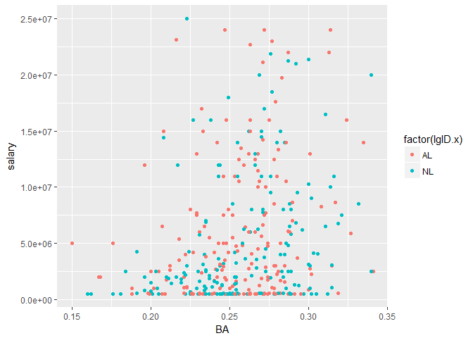<!-- -->


```r
ggplot(data=dat, mapping=aes(x=BA)) + 
  geom_histogram(aes(y = ..density..)) + geom_density(color="red")
```

```
## `stat_bin()` using `bins = 30`. Pick better value with `binwidth`.
```

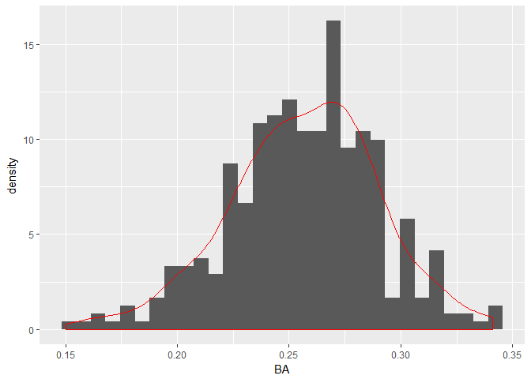<!-- -->

```r
qqnorm(dat[,"BA"])
qqline(dat[,"BA"], col="red")
```

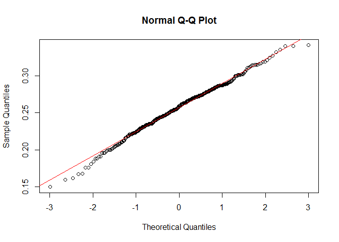<!-- -->

```r
shapiro.test(dat[,"BA"])
```

```
## 
## 	Shapiro-Wilk normality test
## 
## data:  dat[, "BA"]
## W = 0.9933, p-value = 0.1045
```

The BA variable looks pretty normal, which is a bit suprising to me! We even pass the shapiro test. How about the salary?


```r
ggplot(data=dat, mapping=aes(x=salary)) + 
  geom_histogram(aes(y = ..density..)) + geom_density(color="red")
```

```
## `stat_bin()` using `bins = 30`. Pick better value with `binwidth`.
```

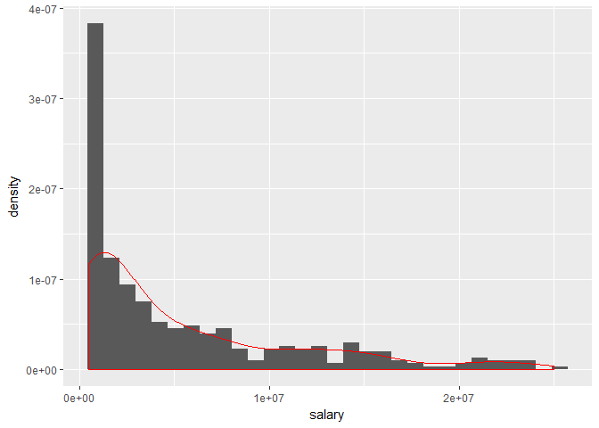<!-- -->

```r
qqnorm(dat[,"salary"])
qqline(dat[,"salary"], col="red")
```

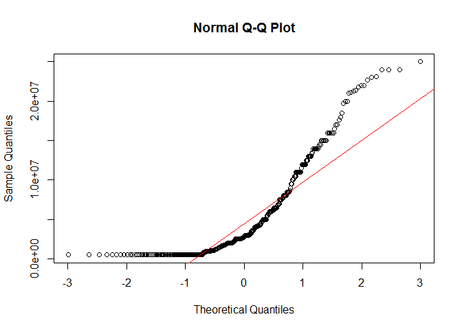<!-- -->

```r
shapiro.test(dat[,"salary"])
```

```
## 
## 	Shapiro-Wilk normality test
## 
## data:  dat[, "salary"]
## W = 0.79983, p-value < 2.2e-16
```

This is so right skewed...This look likes an [exponential distribution](https://en.wikipedia.org/wiki/Exponential_distribution). One possible way to deal with this right skewed data is to log transform it. 


```r
dat = dat %>%
  mutate(sal.log=log(salary))
ggplot(data=dat, mapping=aes(x=sal.log)) + 
  geom_histogram(aes(y = ..density..)) + geom_density(color="red")
```

```
## `stat_bin()` using `bins = 30`. Pick better value with `binwidth`.
```

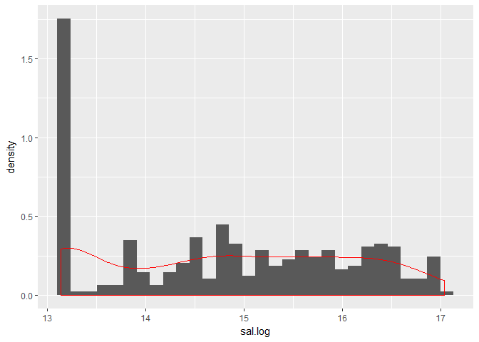<!-- -->

```r
qqnorm(dat[,"sal.log"])
qqline(dat[,"sal.log"], col="red")
```

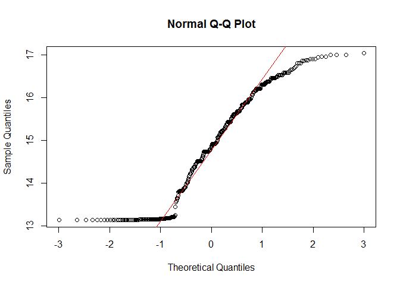<!-- -->

```r
shapiro.test(dat[,"sal.log"])
```

```
## 
## 	Shapiro-Wilk normality test
## 
## data:  dat[, "sal.log"]
## W = 0.92101, p-value = 6.14e-13
```

Apparently, log-transformation does not help a lot...For the purpose of this class, we'll just remove those whose salary is too low (say 7.29416\times 10^{5}, sorry to those players...). In reality, this is the case you'll have to do generalized linear model, which will be covered later. Stay tuned!


```r
dat = dat %>%
  filter(sal.log>13.5) 
ggplot(data=dat, mapping=aes(x=sal.log)) + 
  geom_histogram(aes(y = ..density..)) + geom_density(color="red")
```

```
## `stat_bin()` using `bins = 30`. Pick better value with `binwidth`.
```

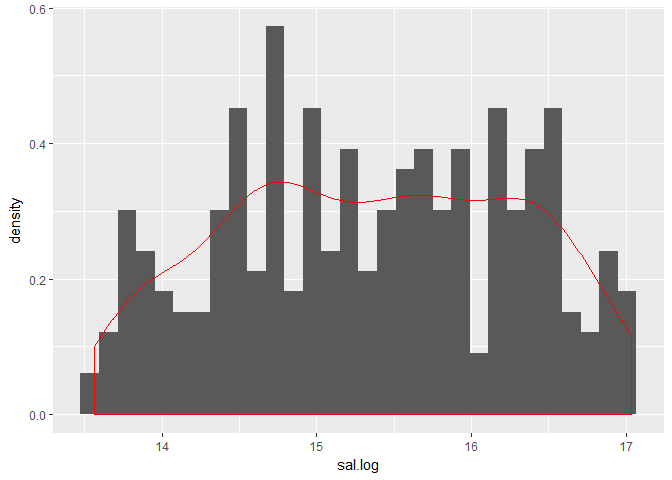<!-- -->

```r
qqnorm(dat[,"sal.log"])
qqline(dat[,"sal.log"], col="red")
```

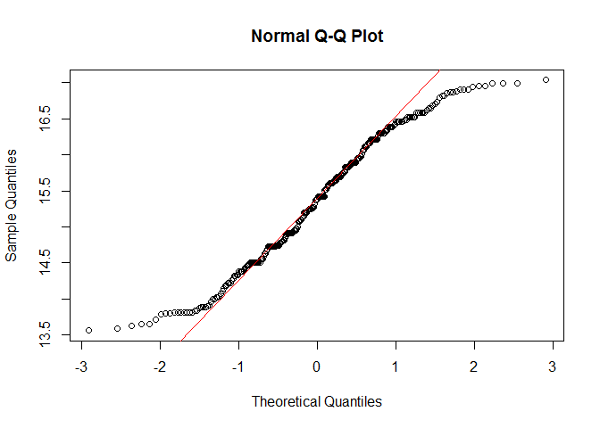<!-- -->

```r
shapiro.test(dat[,"sal.log"])
```

```
## 
## 	Shapiro-Wilk normality test
## 
## data:  dat[, "sal.log"]
## W = 0.96634, p-value = 4.469e-06
```

Still not perfect, but better.

Let's see how the salary related to the Batting Average in each league. First, the American league. 


```r
dat %>%
  filter(lgID.x=="AL") %>%
  ggplot()+
    geom_point(aes(x=BA, y=sal.log), color="red")+
    labs(x="Batting Average", y="Log(salary)", title="American League")+
    geom_smooth(aes(x=BA, y=sal.log), method="lm", color="black", se=FALSE)
```

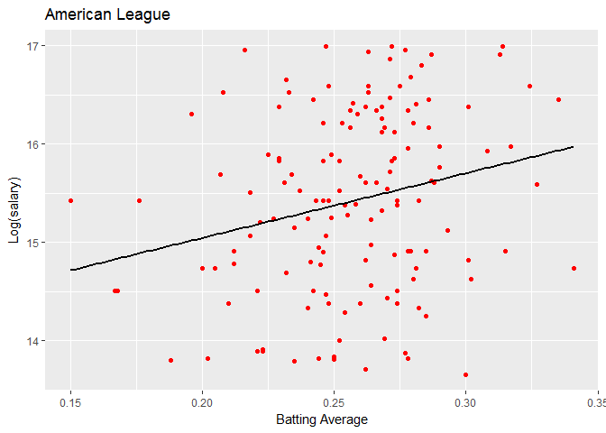<!-- -->

```r
dat.AL = dat %>%
  filter(lgID.x=="AL")
summary(lm(sal.log~ BA, data=dat.AL))
```

```
## 
## Call:
## lm(formula = sal.log ~ BA, data = dat.AL)
## 
## Residuals:
##      Min       1Q   Median       3Q      Max 
## -2.04932 -0.67376  0.04229  0.70978  1.80691 
## 
## Coefficients:
##             Estimate Std. Error t value Pr(>|t|)    
## (Intercept)   13.728      0.589  23.307  < 2e-16 ***
## BA             6.581      2.279   2.888  0.00448 ** 
## ---
## Signif. codes:  0 '***' 0.001 '**' 0.01 '*' 0.05 '.' 0.1 ' ' 1
## 
## Residual standard error: 0.8989 on 143 degrees of freedom
## Multiple R-squared:  0.05511,	Adjusted R-squared:  0.0485 
## F-statistic:  8.34 on 1 and 143 DF,  p-value: 0.004481
```

We see that there is a significant positive relationship between salary and BA in the American league.  

How about the National League?


```r
dat %>%
  filter(lgID.x=="NL") %>%
  ggplot(aes(x=BA, y=sal.log))+
    geom_point(color="blue")+
    labs(x="Batting Average", y="Log(salary)", title="National League")+
    geom_smooth(aes(x=BA, y=sal.log), method="lm", color="black", se=FALSE)
```

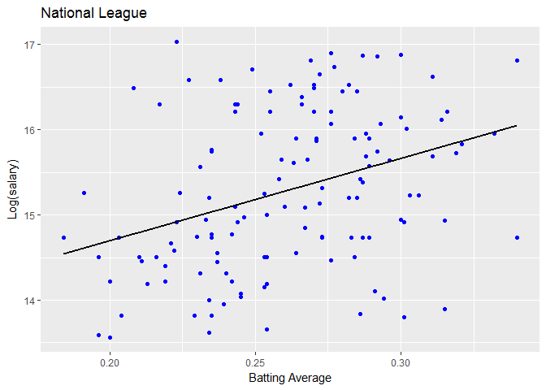<!-- -->

```r
dat.NL = dat %>%
  filter(lgID.x=="NL")
summary(lm(sal.log~ BA, data=dat.NL))
```

```
## 
## Call:
## lm(formula = sal.log ~ BA, data = dat.NL)
## 
## Residuals:
##      Min       1Q   Median       3Q      Max 
## -1.90821 -0.67400 -0.08267  0.66450  2.11300 
## 
## Coefficients:
##             Estimate Std. Error t value Pr(>|t|)    
## (Intercept)  12.7730     0.5969  21.398  < 2e-16 ***
## BA            9.6338     2.2685   4.247  4.1e-05 ***
## ---
## Signif. codes:  0 '***' 0.001 '**' 0.01 '*' 0.05 '.' 0.1 ' ' 1
## 
## Residual standard error: 0.879 on 130 degrees of freedom
## Multiple R-squared:  0.1218,	Adjusted R-squared:  0.1151 
## F-statistic: 18.03 on 1 and 130 DF,  p-value: 4.1e-05
```

Graphically and statistically, the relationship between salary and BA differs from league to league. We can do ANCOVA to statistically examine if the relationship does significantly differ from league to league. 

## Execute ANCOVA

We can use `lm()` function to do ancova. You can also use `aov()` function. The only difference is just the final summary table. 


```r
mod = lm(sal.log~ BA*lgID.x, data=dat)
aov = aov(sal.log~ BA*lgID.x, data=dat)
```

The "BA" is a continuous variable and the "lgID.x" is a categorical variable. The "*" means we specify a interaction term between the two variables in the model. 


```r
summary(mod)
```

```
## 
## Call:
## lm(formula = sal.log ~ BA * lgID.x, data = dat)
## 
## Residuals:
##      Min       1Q   Median       3Q      Max 
## -2.04932 -0.67376 -0.01607  0.70978  2.11300 
## 
## Coefficients:
##             Estimate Std. Error t value Pr(>|t|)    
## (Intercept)  13.7280     0.5828  23.554  < 2e-16 ***
## BA            6.5809     2.2549   2.919  0.00381 ** 
## lgID.xNL     -0.9550     0.8394  -1.138  0.25623    
## BA:lgID.xNL   3.0529     3.2178   0.949  0.34358    
## ---
## Signif. codes:  0 '***' 0.001 '**' 0.01 '*' 0.05 '.' 0.1 ' ' 1
## 
## Residual standard error: 0.8894 on 273 degrees of freedom
## Multiple R-squared:  0.09172,	Adjusted R-squared:  0.08174 
## F-statistic: 9.189 on 3 and 273 DF,  p-value: 8.213e-06
```

```r
anova(mod)
```

```
## Analysis of Variance Table
## 
## Response: sal.log
##            Df  Sum Sq Mean Sq F value    Pr(>F)    
## BA          1  19.221 19.2209 24.2963 1.435e-06 ***
## lgID.x      1   1.875  1.8754  2.3707    0.1248    
## BA:lgID.x   1   0.712  0.7121  0.9002    0.3436    
## Residuals 273 215.971  0.7911                      
## ---
## Signif. codes:  0 '***' 0.001 '**' 0.01 '*' 0.05 '.' 0.1 ' ' 1
```

```r
summary(aov)
```

```
##              Df Sum Sq Mean Sq F value   Pr(>F)    
## BA            1  19.22  19.221  24.296 1.44e-06 ***
## lgID.x        1   1.88   1.875   2.371    0.125    
## BA:lgID.x     1   0.71   0.712   0.900    0.344    
## Residuals   273 215.97   0.791                     
## ---
## Signif. codes:  0 '***' 0.001 '**' 0.01 '*' 0.05 '.' 0.1 ' ' 1
```

Here the intercept is the salary of players in American league (due to alphabetical reason) when BA is 0. The estimate of BA means the effects of BA on players in AL. The estimate of lgID is the average salary difference between AL and NL. The interaction term means whether the effect of BA differ from AL to NL. 

From the output, we see that the interaction term is NOT significant. This means that the effect (the coefficient) of one variable does NOT depends on the other one. In the case, we can say the relationship between salary and BA is not significantly different from league to league.  

## Interaction plot

We can use a package called `interplot` that allows us to visualize 


```r
library(interplot)
interplot(m=mod, var1="BA", var2="lgID.x")+
  labs(x="League ID", y="Estimated coefficient for BA", title="Estimated Coefficient of BA on League ID")
```

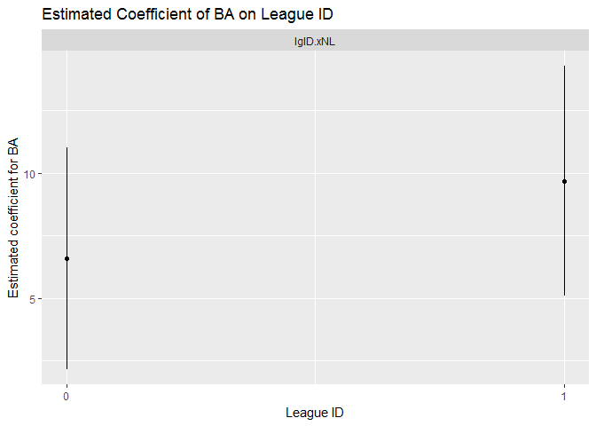<!-- -->

This plot means the effect (regression coefficient) of BA on salary is higher in NL than in the AL, but the difference is NOT significant.

Or, we can have another aspect of the interaction plot. 


```r
interplot(m=mod, var1="lgID.x", var2="BA")+
  labs(x="BA", y="Estimated coefficient for League ID", title="Estimated Coefficient of League ID on BA")
```

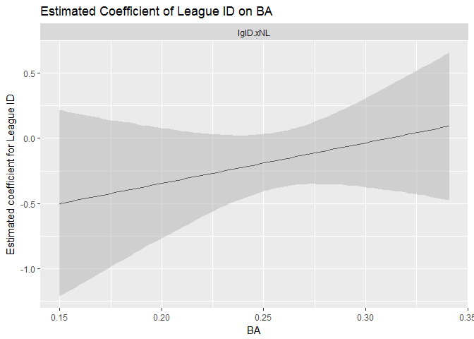<!-- -->

This means the salary in NL is first lower than in AL (negative intecept of this figure), but this difference gradually decrease with the increase of BA. Finally, when BA is high enough (over 0.3), the salary in NL is higher than in AL. However, this change of salary difference is BOT significant.

---------------------------------------------------------------------------------------------------------------------------------

__Exercise 1__(5 pt)

Try to use the following data set to execute ANCOVA and make interaction plots
This data set contains the fruit weight (Fruit) of different plants with different root depth (root) and different treatment (Grazing).


```r
gz = read.table(text=getURL("https://raw.githubusercontent.com/OscarFHC/NRE538_GSRA/master/Labs/NRE538_ANCOVA_n_Interaction/ipomopsis.txt"), sep="", header=T,comment.char="#")
head(gz)
```

```
##    Root Fruit  Grazing
## 1 6.225 59.77 Ungrazed
## 2 6.487 60.98 Ungrazed
## 3 4.919 14.73 Ungrazed
## 4 5.130 19.28 Ungrazed
## 5 5.417 34.25 Ungrazed
## 6 5.359 35.53 Ungrazed
```


---------------------------------------------------------------------------------------------------------------------------------

# Interaction terms

Keep in mind that anova, ancova and linear regression are all linear models with following formula.

$$Y_i = \beta_0 + \beta_{i1} X_{i1} + \beta_{i2} X_{i2} + ... + \beta_{ip} X_{ip} + \varepsilon_i$$

, where $Y_i$ is the dependent variable (response variable) $i$, $X_{ip}$ are the independent variable, and $\varepsilon_i$ is the error. 

The difference between ANOVA/ANCOVA and linear regression is just the difference between $X_{ip}$. In ANOVA, $X_{ip}$ are categorical variable and in regression, $X_{ip}$ are continuous variable. In ANCOVA, it is the combination of the two. 

In this sense, we can also include interaction term in the linear regression model we had before. We used the [air quality data in New York](https://stat.ethz.ch/R-manual/R-devel/library/datasets/html/airquality.html) before to demonstrate the regression analysis. Let's make it more complicated. 


```r
data("airquality")
head(airquality, 15)
```

```
##    Ozone Solar.R Wind Temp Month Day
## 1     41     190  7.4   67     5   1
## 2     36     118  8.0   72     5   2
## 3     12     149 12.6   74     5   3
## 4     18     313 11.5   62     5   4
## 5     NA      NA 14.3   56     5   5
## 6     28      NA 14.9   66     5   6
## 7     23     299  8.6   65     5   7
## 8     19      99 13.8   59     5   8
## 9      8      19 20.1   61     5   9
## 10    NA     194  8.6   69     5  10
## 11     7      NA  6.9   74     5  11
## 12    16     256  9.7   69     5  12
## 13    11     290  9.2   66     5  13
## 14    14     274 10.9   68     5  14
## 15    18      65 13.2   58     5  15
```


```r
mod = lm(Temp~Wind, data=airquality)
summary(mod)
```

```
## 
## Call:
## lm(formula = Temp ~ Wind, data = airquality)
## 
## Residuals:
##     Min      1Q  Median      3Q     Max 
## -23.291  -5.723   1.709   6.016  19.199 
## 
## Coefficients:
##             Estimate Std. Error t value Pr(>|t|)    
## (Intercept)  90.1349     2.0522  43.921  < 2e-16 ***
## Wind         -1.2305     0.1944  -6.331 2.64e-09 ***
## ---
## Signif. codes:  0 '***' 0.001 '**' 0.01 '*' 0.05 '.' 0.1 ' ' 1
## 
## Residual standard error: 8.442 on 151 degrees of freedom
## Multiple R-squared:  0.2098,	Adjusted R-squared:  0.2045 
## F-statistic: 40.08 on 1 and 151 DF,  p-value: 2.642e-09
```

```r
plot(Temp~Wind, data=airquality)
abline(lm(Temp~Wind, data=airquality), col="red")
```

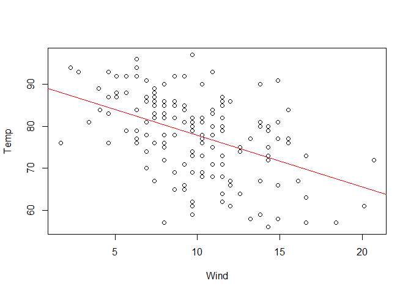<!-- -->

This is the linear model we have seen before. We can have a interaction terms in the model but we first need to have two independent variables. 


```r
mod1 = lm(Temp~Wind + Ozone, data=airquality)
summary(mod1)
```

```
## 
## Call:
## lm(formula = Temp ~ Wind + Ozone, data = airquality)
## 
## Residuals:
##     Min      1Q  Median      3Q     Max 
## -21.487  -5.137   1.220   4.674  13.102 
## 
## Coefficients:
##             Estimate Std. Error t value Pr(>|t|)    
## (Intercept) 74.18035    2.96526  25.017  < 2e-16 ***
## Wind        -0.37829    0.22080  -1.713   0.0894 .  
## Ozone        0.17615    0.02393   7.362 3.15e-11 ***
## ---
## Signif. codes:  0 '***' 0.001 '**' 0.01 '*' 0.05 '.' 0.1 ' ' 1
## 
## Residual standard error: 6.762 on 113 degrees of freedom
##   (37 observations deleted due to missingness)
## Multiple R-squared:  0.5007,	Adjusted R-squared:  0.4918 
## F-statistic: 56.65 on 2 and 113 DF,  p-value: < 2.2e-16
```

In the above model, there is not interaction terms. We can include it by changing "+" to "*". 


```r
mod2 = lm(Temp~Wind * Ozone, data=airquality)
summary(mod2)
```

```
## 
## Call:
## lm(formula = Temp ~ Wind * Ozone, data = airquality)
## 
## Residuals:
##      Min       1Q   Median       3Q      Max 
## -15.2008  -4.1492   0.5976   4.6656  13.4738 
## 
## Coefficients:
##              Estimate Std. Error t value Pr(>|t|)    
## (Intercept) 80.268679   3.141135  25.554  < 2e-16 ***
## Wind        -1.133278   0.275753  -4.110 7.57e-05 ***
## Ozone        0.015800   0.044790   0.353    0.725    
## Wind:Ozone   0.023505   0.005687   4.133 6.93e-05 ***
## ---
## Signif. codes:  0 '***' 0.001 '**' 0.01 '*' 0.05 '.' 0.1 ' ' 1
## 
## Residual standard error: 6.326 on 112 degrees of freedom
##   (37 observations deleted due to missingness)
## Multiple R-squared:  0.5668,	Adjusted R-squared:  0.5552 
## F-statistic: 48.84 on 3 and 112 DF,  p-value: < 2.2e-16
```

From the above model output, we see that there is a significant interaction between Wind and Ozone. This means that the coefficient of one variable depends on the other one. For example, we can use interaction plot to visualize how the coefficient of Ozone depends on Wind.


```r
interplot(mod2, var1="Wind", var2="Ozone")+
  labs(x="Wind", y="coefficient for Ozone")
```

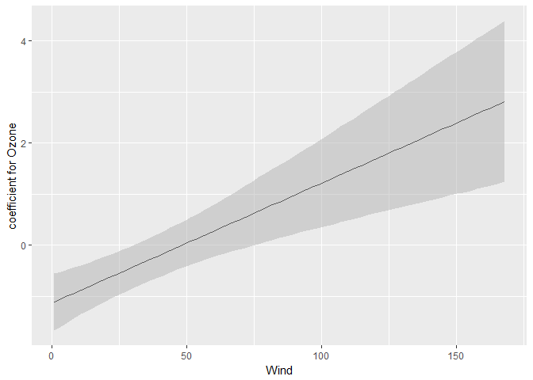<!-- -->


```r
interplot(mod2, var1="Ozone", var2="Wind")+
  labs(x="Ozone", y="coefficient for Wind")
```

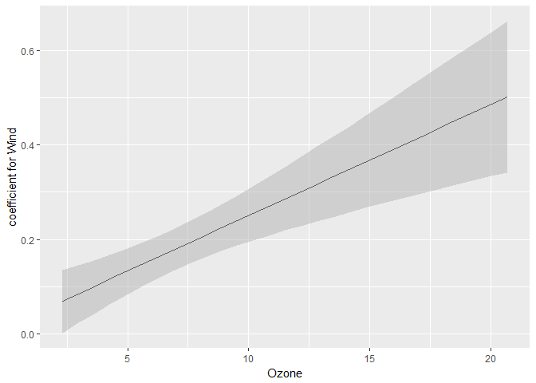<!-- -->


---------------------------------------------------------------------------------------------------------------------------------

__Exercise 2__[Bonus 5 pt

1. Use `F-test` to compare _mod.1_ and _mod.2_. Explain why you chose one over another to explain the data.


2. Plot two interaction plots with `interplot()` for the model with wind and solar radiation as the independent variables. Interprete the two interaction plots. 


---------------------------------------------------------------------------------------------------------------------------------

Note that as we include the interaction term in the model, the coefficient for Ozone becomes non-significant. This is because Ozone and Wind are highly correlated. 


```r
cor(airquality[,"Ozone"], airquality[,"Wind"], use="na.or.complete")
```

```
## [1] -0.6015465
```

If encountering this case we should remove the main effect of Ozone, since the interaction between Wind and Ozone is significant but the main effect for Ozone is non-significant. 


```r
mod3 = lm(Temp~Wind + Wind:Ozone, data=airquality)
summary(mod3)
```

```
## 
## Call:
## lm(formula = Temp ~ Wind + Wind:Ozone, data = airquality)
## 
## Residuals:
##      Min       1Q   Median       3Q      Max 
## -15.2622  -3.9667   0.5829   4.6323  13.6894 
## 
## Coefficients:
##              Estimate Std. Error t value Pr(>|t|)    
## (Intercept) 81.101122   2.065187  39.271  < 2e-16 ***
## Wind        -1.210998   0.165189  -7.331 3.68e-11 ***
## Wind:Ozone   0.025242   0.002831   8.916 9.81e-15 ***
## ---
## Signif. codes:  0 '***' 0.001 '**' 0.01 '*' 0.05 '.' 0.1 ' ' 1
## 
## Residual standard error: 6.302 on 113 degrees of freedom
##   (37 observations deleted due to missingness)
## Multiple R-squared:  0.5663,	Adjusted R-squared:  0.5586 
## F-statistic: 73.77 on 2 and 113 DF,  p-value: < 2.2e-16
```

```r
anova(mod2, mod3)
```

```
## Analysis of Variance Table
## 
## Model 1: Temp ~ Wind * Ozone
## Model 2: Temp ~ Wind + Wind:Ozone
##   Res.Df    RSS Df Sum of Sq      F Pr(>F)
## 1    112 4482.7                           
## 2    113 4487.7 -1   -4.9808 0.1244 0.7249
```

From the above results, we see that the two models are not significantly different from each other in terms of the amount of variance of response variable being explained. This is based on `F-test` we have learned from the multiple regression session. This can only be executed if the two models are [nested](https://en.wikipedia.org/wiki/Statistical_model#Nested_models). 
