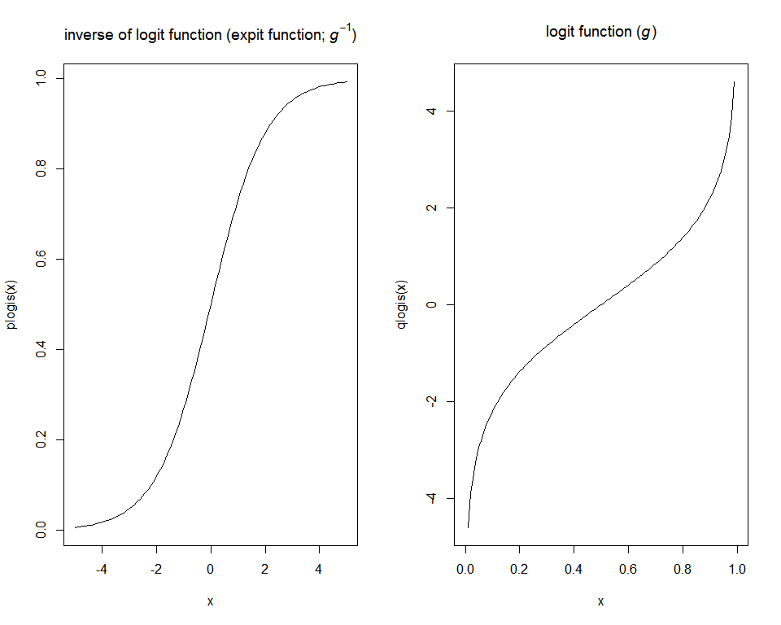

# NRE538_Generalized Linear Model
Oscar Feng-Hsun Chang  
Week12  

\newcommand\expect[1]{\mathbb{E}\left[{#1}\right]}
\newcommand\var[1]{\mathrm{Var}\left[{#1}\right]}


# Rationale

We talked about linear models when dealing with data following normal distribution. However, mother nature is not always that nice to us... Luckily, we have lots of brilliant mathematicians and statisticians who developed __generalized linear model (GLM)__ that can be used when encountering non-normally distributed data.

The idea of GLM is to use a link function to "link" (or your can think it's being transformed) the distribution mean $\mu$, that the dependent variable (Y) follows to the outcome of linear predictors (independent variables, or X). The model can be written in the following form:

$$Y_i\ \stackrel{\text{i.i.d.}}{\sim}\ f(\mu,\ \dots)$$

$$ g(\mu)\ = \ X\,\beta_i$$

- The $f$ is the Error distribution, BUT! it is actually the distribution of your dependent variable (i.e. the **data distribution**)... Theoretically, this can be ANY distribution.
- The $g$ is the **link function**. 

To determine what data distribution to use requires you to understand how your data is being generated. For example, it would be logical to use [binomial distribution](https://en.wikipedia.org/wiki/Binomial_distribution) as the data distribution if you are dealing with a yes-no data set. To determine what link function to use requires **knowledge of the data**, **theoretical consideration**, and especially the **empirical fit** to the data. Most of the time, there is a special link function that goes together with the data distribution, which is also called canonical link function. However, always keep in mind that __chosing data distribution and link function is just two pieces of the model__. It is just like figuring out what independent variables to include in your model.  
The following two posts are pretty clear in explaining link function and some conceptual theory of GLM. I encourage you to read them.  
[GLM](http://stats.stackexchange.com/questions/40876/difference-between-link-function-and-canonical-link-function-for-glm)  
[link function](http://stats.stackexchange.com/questions/20523/difference-between-logit-and-probit-models#30909)  

In the generalized linear model, the dependent variable does not need to follow the normal distribution (i.e. $f$ does not need to be a normal distribution). However, if $f$ is a [exponential family](https://en.wikipedia.org/wiki/Exponential_family), then the fitting is more effective and can be achieved easily by the `glm` function in __R__. 

We will not get into the detailed mathematical theory of the generalized linear function, but just the application of this `glm` function in this class. 

# GLM Application

## Binomial data (logistic regression)

We will use the data set about whether a household moved to a safe well after being noticed about the unsafty of their wells. Other background information about the house hold are also included. The data set is from @gelman2006 (http://www.stat.columbia.edu/~gelman/arm/).

- `switch`: Whether the household with unsafe wells moved after being encouraged to switch to nearby private or community
wells or to new wells of their own construction.  
- `arsenic`: Natural arsenic concentration in well water in ppm.  
- `dist`: The distance for a certain house hold to the closest known safe well in 100 meter    
- `assoc`: Whether any members of the household are active in community organizations.  
- `educ`: The education level of the head of household.  

Again, let's first do some exploratory analysis. 


```r
well=read.csv(text=getURL("https://raw.githubusercontent.com/OscarFHC/NRE538_GSRA/master/Labs/NRE538_GLM/wells.csv"), sep=",", header=T,comment.char="#")
well = well %>%
  mutate(dist100 = dist/100)
```


```r
cor(well)
```

```
##              switch     arsenic         dist        assoc        educ
## switch   1.00000000  0.18386827 -0.117941730 -0.035914753  0.07637076
## arsenic  0.18386827  1.00000000  0.178057697 -0.024911525 -0.02956287
## dist    -0.11794173  0.17805770  1.000000000 -0.003460305 -0.02674095
## assoc   -0.03591475 -0.02491153 -0.003460305  1.000000000 -0.03136667
## educ     0.07637076 -0.02956287 -0.026740946 -0.031366669  1.00000000
## dist100 -0.11794173  0.17805770  1.000000000 -0.003460305 -0.02674095
##              dist100
## switch  -0.117941730
## arsenic  0.178057697
## dist     1.000000000
## assoc   -0.003460305
## educ    -0.026740946
## dist100  1.000000000
```

```r
pairs(well, lower.panel=panel.lm, upper.panel=panel.cor)
```

<!-- -->

It seems whether a household would move or not are correlated with these variables. Let's build a logistic model with `glm` function to explain how arsenic concentration affect whether a household move or not. 

Since the dependent variable is a binary choice (move or not), so it should follow a binomial distribution. This mean the $f$ function in this case is a binomial distribution. The link function that is most commonly used (the canonical link function) with binomial distribution is the [`logit` function](https://en.wikipedia.org/wiki/Logit). The logit function and its inverse function are shown for your interest.


```r
op <- par(mfrow=c(1,2))
curve(plogis(x),from=-5,to=5, main=expression(paste("inverse of logit function (expit function; ", italic(g^{-1}), ")", sep="")))
curve(qlogis(x),from=0,to=1, main=expression(paste("logit function (", italic(g), ")", sep="")))
```

<!-- -->

```r
par(op)
```

For those who are curious, if we assign the house hold that moved to 1 and those don't move to 0, the model formula can be written as the following.

$$ \text{Prob}(Y_i=1) = p_i$$  

$$ \text{logit}(p_i) = log\ (\frac{P_i}{1-P_1})= X_i \ \beta$$  


Here the $X_i$ are the linear predictors. In the current example, it is the arsenic concentration and a intercept. 

We can use the following code to fit a GLM to the data. 


```r
mod1 = glm(switch~arsenic, data=well, family=binomial(link="logit"))
summary(mod1)
```

```
## 
## Call:
## glm(formula = switch ~ arsenic, family = binomial(link = "logit"), 
##     data = well)
## 
## Deviance Residuals: 
##    Min      1Q  Median      3Q     Max  
## -2.331  -1.201   0.822   1.097   1.225  
## 
## Coefficients:
##             Estimate Std. Error z value Pr(>|z|)    
## (Intercept) -0.30553    0.07030  -4.346 1.39e-05 ***
## arsenic      0.37914    0.03853   9.840  < 2e-16 ***
## ---
## Signif. codes:  0 '***' 0.001 '**' 0.01 '*' 0.05 '.' 0.1 ' ' 1
## 
## (Dispersion parameter for binomial family taken to be 1)
## 
##     Null deviance: 4118.1  on 3019  degrees of freedom
## Residual deviance: 4008.7  on 3018  degrees of freedom
## AIC: 4012.7
## 
## Number of Fisher Scoring iterations: 4
```

### Model interpretation

To interpret the results from logistic regression (or other GLM) is like interpreting other linear models. The only difference is that the linear predictors now determines **the parameters describing the data distribution ($f$)**, not the dependent variable  _per se_. 

To interpret this model, the probability for a house hold to move ($p_i$) after transformation (by the inverse of link function) is now being significantly influenced by the arsenic concentration. Also, even when the arsenic concentration is 0, there is still a probability for a house hold to move (significant intercept). 


From this model, the predicted probability for a house hold to move when experiencing 0 arsenic concentration is 0.4242. The probability for a house hold to move when experiencing average arsenic concentration is 0.58. 

Since we are dealing with binomial data, it is natural to talk about odds ratio (i.e. $\frac{p_i}{1-P_i}$). In fact, it is the $e$ to the outcome of linear predictors after transformed by the link function. The odds ratio for a house hold to move when experiencing 0 arsenic concentration is 0.7367 and for a house hold to move when experiencing average arsenic concentration is 1.3808. 

We can also plot the predicted probability of moving onto the data. 


```r
plot(switch~arsenic, data=well, ylim=c(0,1), ylab="probability of move")
curve (plogis(int + coef.ar*x), from=min(well[,"arsenic"]), to=max(well[,"arsenic"]), add=TRUE, col="red")
```

<!-- -->

### Model checking

How do we know if the model does a good job capturing the patterns in the data then?

There are a few ways to check the model and each with different purposes.

- Simulation  
- Inspection plots  
- model comparison  

One useful way is to to simulation based on the estimated parameters and see if the simulated data agree with the actual data. 


```r
pi = predict(mod1, type="response")

s = t(replicate(200, rbinom(n=length(pi), size = nrow(well), prob=pi)))

well = well %>%
  mutate(ind=seq(nrow(well)))

sim = s %>%
  melt(varnames=c("sim", "ind")) %>%
  join(well, type="left", by="ind")

simsum = sim %>%
  ddply(~ind,summarize,
        med=quantile(value,0.5),
        lo=quantile(value,0.05),
        hi=quantile(value,0.95)) %>%
  join(well, type="left", by="ind")
simsum[,"med"] = simsum[,"med"]/nrow(well)
simsum[,"lo"] = simsum[,"lo"]/nrow(well)
simsum[,"hi"] = simsum[,"hi"]/nrow(well)

ggplot(mapping=aes(x=arsenic))+
  geom_point(data=simsum, aes(y=switch),size=3,color='black')+
  geom_errorbar(data=simsum, aes(ymin=lo,ymax=hi), col="red")
```

<!-- -->

Because the estimated coefficients are pretty precise (small SE), so that the error bar is rather narrow. This plot looks almost identical to the one we overlay predicted probability onto the data. 

Another way is to use the built-in function to plot the inspection plots.


```r
plot(mod1, which=1)
```

<!-- -->

```r
plot(residuals(mod1)~ arsenic, data=well)
abline(h=0, col="red")
```

<!-- -->

As you can imaging, the data is either 1 or 0, so the residual plots might not be too useful to inform us how good the model fitting is. 

Finally ewe can compare the model with arsenic as the explanatory variable with the one without it by using `anova` or `AIC`. The two are similar to each other but not the same.

When using `anova`, we are comparing the [__deviance__](https://en.wikipedia.org/wiki/Deviance_(statistics)) of the two model, which is similar to comparing residual variance in simple linear. ANOVA is using likelihood ratio test to compare the deviance of the two models as the difference of the deviance follows _chi-square_ distribution. On the other hand, [AIC](https://en.wikipedia.org/wiki/Akaike_information_criterion) is to compare the likelihood of the two models with consideration of the number of parameters, but it does NOT! base on any hypothesis testing. 


```r
mod0 = glm(switch~1, data=well, family=binomial(link=logit))
summary(mod0)
```

```
## 
## Call:
## glm(formula = switch ~ 1, family = binomial(link = logit), data = well)
## 
## Deviance Residuals: 
##    Min      1Q  Median      3Q     Max  
## -1.308  -1.308   1.052   1.052   1.052  
## 
## Coefficients:
##             Estimate Std. Error z value Pr(>|z|)    
## (Intercept)  0.30296    0.03681    8.23   <2e-16 ***
## ---
## Signif. codes:  0 '***' 0.001 '**' 0.01 '*' 0.05 '.' 0.1 ' ' 1
## 
## (Dispersion parameter for binomial family taken to be 1)
## 
##     Null deviance: 4118.1  on 3019  degrees of freedom
## Residual deviance: 4118.1  on 3019  degrees of freedom
## AIC: 4120.1
## 
## Number of Fisher Scoring iterations: 4
```

```r
anova(mod0, mod1, test="Chi")
```

```
## Analysis of Deviance Table
## 
## Model 1: switch ~ 1
## Model 2: switch ~ arsenic
##   Resid. Df Resid. Dev Df Deviance  Pr(>Chi)    
## 1      3019     4118.1                          
## 2      3018     4008.7  1   109.43 < 2.2e-16 ***
## ---
## Signif. codes:  0 '***' 0.001 '**' 0.01 '*' 0.05 '.' 0.1 ' ' 1
```

```r
AIC(mod0, mod1)
```

```
##      df      AIC
## mod0  1 4120.099
## mod1  2 4012.673
```

From the two test, we see that including arsenic concentration as an independent variable (_mod1_) could increase the likelihood of the model and this increase is significant. This is because the probability for _mod1_ to produce the same deviance as _mod0_ is  1.3090247\times 10^{-25}. 

---------------------------------------------------------------------------------------------------------------------------------

__Exercise 1__

Include "dist100" independent variable to the model and compare this model to _mod1_ with `anova` and `AIC`. 


---------------------------------------------------------------------------------------------------------------------------------

## Count data (Poisson distribution)

The second example is to model count data with [Poisson distribution](https://en.wikipedia.org/wiki/Poisson_distribution). 

The data come from @johnson1973species in the [**faraway** package](http://people.bath.ac.uk/jjf23/ELM/), which describes the variables as follows:

- `species` the number of plant species found on the island
- `endemics` the number of endemic species
- `area` the area of the island (km$^2$)
- `elevation` the highest elevation of the island (m)
- `nearest` the distance from the nearest island (km)
- `scruz` the distance from Santa Cruz island (km)
- `adjacent` the area of the adjacent island (km$^2$)

Again, we first do a simple correlation plot for each pair of variables.


```r
library(faraway)
```

```
## 
## Attaching package: 'faraway'
```

```
## The following object is masked from 'package:plyr':
## 
##     ozone
```

```r
data(gala)
head(gala)
```

```
##              Species Endemics  Area Elevation Nearest Scruz Adjacent
## Baltra            58       23 25.09       346     0.6   0.6     1.84
## Bartolome         31       21  1.24       109     0.6  26.3   572.33
## Caldwell           3        3  0.21       114     2.8  58.7     0.78
## Champion          25        9  0.10        46     1.9  47.4     0.18
## Coamano            2        1  0.05        77     1.9   1.9   903.82
## Daphne.Major      18       11  0.34       119     8.0   8.0     1.84
```

```r
pairs(gala, lower.panel=panel.lm, upper.panel=panel.cor)
```

<!-- -->

---------------------------------------------------------------------------------------------------------------------------------

__Exercise 2__

Try using simple linear model `lm` to build a model with Species as dependent variable and all other variables except endemic as independent variables. Inspect the plot of residuals versus fitted value model and describe what do you see. 


---------------------------------------------------------------------------------------------------------------------------------

The results should not look good, right? Because the distribution of Species variable clearly does not follow normal distribution. It is right skewed.


```r
hist(gala$Species, breaks=10)
```

<!-- -->

We can build a glm with Poisson distribution to fix this issue.


```r
mod1.g = glm(Species ~ Area+Elevation+Nearest+Scruz+Adjacent, data=gala, family=poisson(link="log"))
summary(mod1.g)
```

```
## 
## Call:
## glm(formula = Species ~ Area + Elevation + Nearest + Scruz + 
##     Adjacent, family = poisson(link = "log"), data = gala)
## 
## Deviance Residuals: 
##     Min       1Q   Median       3Q      Max  
## -8.2752  -4.4966  -0.9443   1.9168  10.1849  
## 
## Coefficients:
##               Estimate Std. Error z value Pr(>|z|)    
## (Intercept)  3.155e+00  5.175e-02  60.963  < 2e-16 ***
## Area        -5.799e-04  2.627e-05 -22.074  < 2e-16 ***
## Elevation    3.541e-03  8.741e-05  40.507  < 2e-16 ***
## Nearest      8.826e-03  1.821e-03   4.846 1.26e-06 ***
## Scruz       -5.709e-03  6.256e-04  -9.126  < 2e-16 ***
## Adjacent    -6.630e-04  2.933e-05 -22.608  < 2e-16 ***
## ---
## Signif. codes:  0 '***' 0.001 '**' 0.01 '*' 0.05 '.' 0.1 ' ' 1
## 
## (Dispersion parameter for poisson family taken to be 1)
## 
##     Null deviance: 3510.73  on 29  degrees of freedom
## Residual deviance:  716.85  on 24  degrees of freedom
## AIC: 889.68
## 
## Number of Fisher Scoring iterations: 5
```

---------------------------------------------------------------------------------------------------------------------------------

__Exercise 3__

Use `anova` to compare the model with Area, Nearest, Scruz, Adjacent as independent variables (mod2.g) and the model with Elevation, Nearest, Scruz, Adjacent as independent variables (mod3.g) to the full model (mod1.g).


* Can you use `anova` to compare mod2.g and mod3.g? Why?

---------------------------------------------------------------------------------------------------------------------------------

### Model interpretation

Since we used log as the link function, we can write the model as following.

$$ Y_i\ \stackrel{\text{i.i.d.}}{\sim}\ Poisson(\mu)$$

$$\mu\ =\ exp(3.155 -0.001 \times \text{Area} + 0.004 \times \text{Elevation} + 0.009 \times \text{Nearest} -0.006\times \text{Scruz} -0.001 \times \text{Adjacent})$$

### Model checking


```r
plot(mod1.g, which=1)
```

<!-- -->


Compare this residual plot with the one you generated. The $R^2$ improved from 0.717 to about 0.796. And the residuals look more homogeneous.

We can also inspect the fitting of this model by doing simulations.


```r
mu = predict(mod1.g, type="response")

s = t(replicate(1000, rpois(n=length(mu), lambda=mu)))

gala =  gala %>%
  mutate(ild=seq(nrow(gala)))

sim = s %>%
  melt(varnames=c("sim", "ild")) %>%
  join(gala, type="left", by="ild")

simsum = sim %>%
  ddply(~ild,summarize,
        med=quantile(value,0.5),
        lo=quantile(value,0.05),
        hi=quantile(value,0.95)) %>%
  join(gala, type="left", by="ild")

ggplot(mapping=aes(x=log(Area)))+
  geom_point(data=simsum, aes(y=Species), size=3, color="red")+
  geom_errorbar(data=simsum, aes(ymin=lo,ymax=hi), col="black")
```

<!-- -->

```r
ggplot(mapping=aes(x=log(Elevation)))+
  geom_point(data=simsum, aes(y=Species), size=3, color="red")+
  geom_errorbar(data=simsum, aes(ymin=lo,ymax=hi), col="black")
```

<!-- -->

* Note that I took a log on the Area variable so that it is more clear to see the spread of Area variable.

We see that this model does a ok job capturing the variance of Species number, but there are still some points that are not covered by the 95% CI. How can we improve the model then?

We can also compare the model with other ones that have different set of parameter combinations (model selection).

We can also plot the residuals against the predicted values.


```r
plot(mod1.g, which=1)
```

<!-- -->

When looking at the residual plots, we should look for two things in the residuals.  
1. Is there any nonlinear relationship between the residuals and the predicted values (independency and normality)? If yes, that suggests a nonlinear term should be included in the model.  
2. Is the variance of the residuals constant (homoscedasticity)? If no, we might have to change the model. For example, having a parameter that determines the over-dispersion sometimes helps improving a model with Poisson distribution. 

> In Poisson distribution, there is only one parameter (i.e. mean=variance=$\theta$) determining the probability density function. This means when the mean is greater, the associated varaince would be greater too. Therefore, there is only so much we can do to build a model to fit the data. In this data, it is highly right skewed (i.e. there is a long tail on the right). If we can have another parameter to take this overdispersion into account, we might be able to better capture the variance of specie number. We unfortunatly do not cover this part in the class, but you are welcome to talk to me if you are interested in this topic. 

References:
