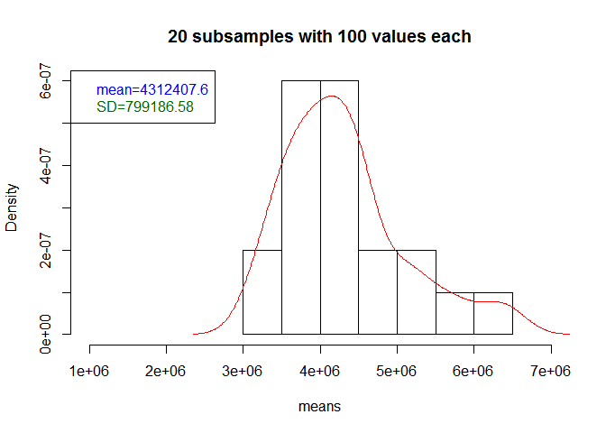
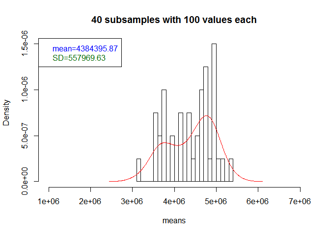
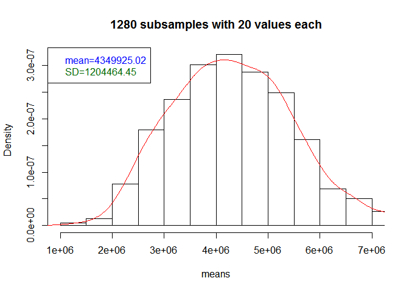
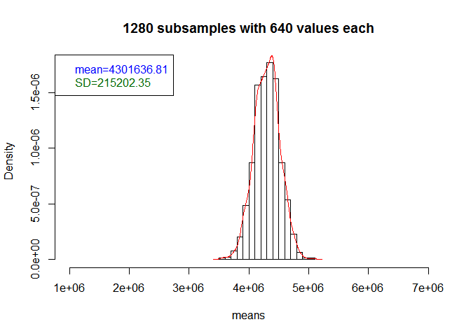

# NRE538_Cental Limit Therom
Oscar Feng-Hsun Chang  
Week3  

# Central limit theorem

To demonstrate the [Central limit theorem](https://en.wikipedia.org/wiki/Central_limit_theorem), I found a cool package, [__Lahman__](https://cran.r-project.org/web/packages/Lahman/Lahman.pdf) containing the salaries of each Major League Baseball player from 1871 to 2015. As you can expect, the salary distribution is a highly right skewed distribution. However, if we subsample sufficiently large number of players and calculate the mean. The distribution of those means will follow normal distribution! Magic~  

Let's first load the package and subset the salaries from just one year. Note that, because the salary data is inside the __Lahman__ package, so we have to use `data()` again to fetch it.   


```r
install.packages("Lahman")
```


```r
library(Lahman)
data("Salaries")
```

Now let's subset the salaries from one single year (say 2015). Do you remember how to do it?


```r
head(money15)
```

```
##       yearID teamID lgID  playerID  salary
## 24759   2015    ARI   NL ahmedni01  508500
## 24760   2015    ARI   NL anderch01  512500
## 24761   2015    ARI   NL chafian01  507500
## 24762   2015    ARI   NL collmjo01 1400000
## 24763   2015    ARI   NL corbipa01  524000
## 24764   2015    ARI   NL delarru01  516000
```


```r
meansVector = function(times, size, dat, varb){
  a = as.numeric(times)
  b = as.numeric(size)
  v = c()
  for(i in 1:a){
    y = sample(dat[,varb],b,replace=TRUE)
    m = mean(y)
    v = c(v,m)
  }
  v
}
```

Here I write a small function, which will return the means of each subsample as a vector. The input of this function is (1) how many times you what to do subsample, (2) in each subsample, how many values you want to take (how many players' salary you want to subsample out), (3) which year you want to do the subsample (in the following case, it's year 2015, but you can subset another year), and (4) which variable you want to do the subsample ( in the following case, it's "salary").  

Let's take a look of the salary distribution in year 2015. 


```r
hist(money15$salary, main = "distribution of salary")
  avg=mean(money15$salary)
  SD=sd(money15$salary)
  abline(v=avg, col="blue")
  legend("topright", legend = c(paste0("mean=", avg), paste0("SD=", SD)),text.col=c("blue", "dark green"))
```

<!-- -->

Obviously, it's highly right skewed.

Now let's plot the histogram of 10 subsamples with 100 values in each subsample. 

<!-- -->

Let's gradually increase the number of subsamples but fix the values in each subsample for now. 

<!-- --><!-- --><!-- --><!-- --><!-- --><!-- --><!-- --><!-- -->


* What do you observe from these series of histograms? What would happen with the increase of the number of subsamples?

How about we fix the number of subsample but increase the value taken in each subsample?  
We start from 1280 subsamples with 10 values in each subsample.

<!-- -->

Let's gradually increase the values taken in each subsample. 

<!-- --><!-- --><!-- --><!-- --><!-- --><!-- --><!-- --><!-- -->

* What do you observe from these series of histograms? What would happen with the increase of values taken in each subsample?

---------------------------------------------------------------------------------------------------------------------------------

__Exercise 1__

Try to create same series of histograms with players' salaries in 2014.

__Exercise 2__

Now demonstrate central limit theorem with the "mpg (miles/gallon)" variable in the [mtcars (Motor Trend Car Road Tests)](https://stat.ethz.ch/R-manual/R-devel/library/datasets/html/mtcars.html) data set. _mtcars_ is another built-in data set in the _base_ package of __R__. You can use the _meansVector_ function I wrote for you to generate a vector of means. 

*hint:*
Make sure that you are able to  
(1) read in (`mtcars`) data,  
(2) plotting the histogram of "mpg" variable  
(3) create a series of histograms with gradually increasing numbers of subsamples but fixed values taken in each subsample  
(4) create a series of histograms with fixed numbers of subsamples but gradually increasing values taken in each subsample

---------------------------------------------------------------------------------------------------------------------------------


```r
data("mtcars")
hist(mtcars$mpg)
```


```r
hist(mtcars$mpg, main = "distribution of mpg", breaks=10)
  avg=mean(mtcars$mpg)
  SD=sd(mtcars$mpg)
  abline(v=avg, col="blue")
  legend("topright", legend = c(paste0("mean=", avg), paste0("SD=", SD)),text.col=c("blue", "dark green"))
# It's a pretty flat distribution (uniform distribution)
```


# Confidence Interval (CI)

Confidence interval contains information about how the precision of the point estimate. We can use CI to make inference about the point estimate. However, when making statement about CI or interpreting CI, two things should be paying extra attention to:  

1. What are model parameters the CI is calculating for?  
2. What is the procedures being used to calculate CI?  

Resampling method is can be used to conveniently and intuitively calculate confidence interval (CI). That is to say, resampling method is a valid procedure to calculate CI. We will see the reampling method briefly in the t-test session and will have a whole session on the resampling method. 

First, a good model and the parameters in the model is the one that is similar to the true model, which generate the data. Of course we seldom have clue about what the true model is. Therefore we use various kind of method to find the "good" model. For example, the maximum likelihood method is one of the popular method to find a good model.  

Second, a valid procedure to calculate X% CI is the one that, when we have a good model and repeat the experiments many times and calculate CI each time, we should be see X% of the CI covers the true parameter value. In other word, we could say, if the model is good, there is X% of chance the CI would cover the true parameter value. Note that it does not mean X% CI will cover the true parameter value with X% chance. It does not, if the model is wrong at the beginning!

The interpretation of X% CI should be, if the model is good and the procedure to calculate CI is valid, the CI should covers the true parameter value with X% probability.  
Let's take an verbal example. We want to know the distribution of the heights of all Taiwanese high school students, so we did some survey and calculate the mean and variation of the survey. We might find that the survey data follows normal distribution, so we would assume the heights of all Taiwanese high school students follow normal distribution as well. Now, the model is a normal distribution (we want to use a normal distribution to describe the data) and the parameters to be estimated are mean and variance. Then based on the features of normal distribution and assumptions we made, we could use the standard error of the model parameters to calculate their confidence interval ([see here if you forgot why](https://en.wikipedia.org/wiki/Standard_error)). Using standard error of the estimated parameter value is the procedure.  

However, if the survey data is not a normal distribution, we can NOT use standard error to calculate the confidence interval of the mean. We will have to either figure out what distribution the survey data follows (which is often pretty challenging), or we can use resampling method! Note that, even when using the resampling method, we still have to justify if the normal distribution is a good model that describes the heights. 

## CI and SE

- [standard error (SE)](https://en.wikipedia.org/wiki/Standard_error): standard deviation of a statistic (e.g. mean). This is very different from the standard deviation of sample!  

- [confidence interval (CI)](https://en.wikipedia.org/wiki/Confidence_interval): the interval within which a statistic is expected to be observed. For example, "95% confidence interval of a statistic is X to Y" means that, if the __model is good enough__ and __a valid procedures__ is being used, we are 95% confident that the true value of the statistic is in X to Y. Upper/lower limit of 95% CI of a statistic is the mean of that statistic plus/minus $r qnorm(0.975)$ SE. [Why?](https://en.wikipedia.org/wiki/1.96)

I'll use the batting average data to demonstrate you the relationship between SE and CI. 

First we load the data and plot its distribution. 


```r
data(Batting)
bat15 = subset(Batting, yearID==2015 & AB>200)
bat15$avg = bat15$H/bat15$AB
hist(bat15$avg, breaks=30, freq=FALSE)
lines(density(bat15$avg), col="red")
```

<!-- -->

```r
shapiro.test(bat15$avg)
```

```
## 
## 	Shapiro-Wilk normality test
## 
## data:  bat15$avg
## W = 0.99669, p-value = 0.7514
```

```r
qqnorm(bat15$avg); qqline(bat15$avg, col="Red")
```

<!-- -->

As this data follows normal distribution pretty well, so we can use SE of the mean to calculate the CI of the mean. The standard error of mean can be calculated as $\frac{SD}{n}$, where _SD_ is the standard deviation and _n_ is sample size. The CI of the mean is plus/minus $r qnorm(0.975)$ SE. 


```
## [1] "standard error calculated base on the central limit theorm = 0.00165"
```

```
## [1] "95% confidence interval base on the central limit theorm : 0.2579 - 0.2644"
```

2. By resampling method. This method is great as it is applicable to all kinds of sample distributions.


```
## [1] "standard error calculated by resampling = 0.00166"
```

```
## [1] "95% confidence interval by resampling : 0.2579 - 0.2644"
```

The CI calculated by two procedures are almost identical. 

How do they look on a figure?

<!-- -->

With the concept of SE and CI in mind, We can dig into the rational of comparing the mean of two sample in more detail.  

> To test if two population means are significantly different from each other at 5% significance level (the $\alpha$ value determined by us), we need to know if the 95% confidence level of the difference between the two population means overlaps 0. If yes, then the two population means are significantly different at 5% significance level. There are multiple ways to calculate the the 95% confidence level.
