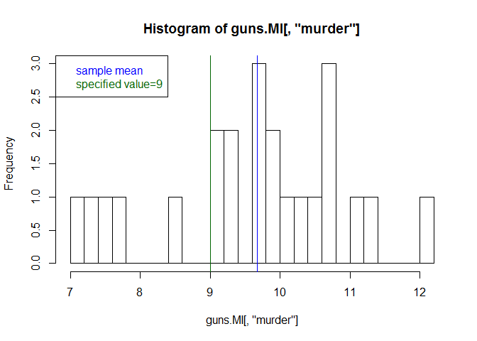
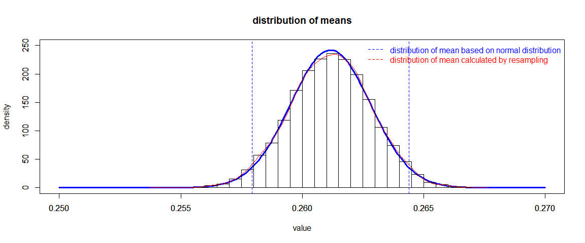

# NRE538_T-test
Oscar Feng-Hsun Chang  
Week4  

# Student's t-test

## One sample t-test

One sample t test is to test the null hypothesis that the population mean is not different from a specified value. This can be done by using `t.test()` in __R__.

To learn how to perform t-test in __R__, we will use another data set that describe the  violent crime rates and concealed-carry laws for 50 US States plus DC. This is a balanced panel of data on 50 US states	plus the District of Columbia (for a total of 51 'states')	 by year for 1977--1999. Each observation is a given state in a given year. There are a total of 51 states times 23 years = 1173 observations. These data were provided by Prof. John Donohue of Stanford University and were used in his paper with Ian Ayres "Shooting Down the 'More Guns Less Crime Hypothesis" (Stanford Law Review	2003)

At this stage, you should be able to read-in data and subset part of the whole data now. 

Or, you can download the file to your local computer by executing the following code (it will be a dataframe named "guns").


```r
library(RCurl)
guns=read.csv(text=getURL("https://raw.githubusercontent.com/OscarFHC/NRE538_GSRA/master/Labs/NRE538_Lab2/guns.csv"), sep=",", header=T, comment.char="#")
```

Here are the description of each variable in the dataframe. All rates are incidents per 10^5 members of the population.  
* year = year  
* violent = violent crime rate  
* murder = murder rate  
* robbery = robbery rate  
* prisoners = incarceration rate in the previous year (per 10^5)  
* afam = percentage of population that is African-American  
* cauc = percentage of population that is Caucasian  
* male = percentage of state population that is male  
* population = state population (in millions)  
* income = real per capita personal income (in US dollars)  
* density = population density (thousands per square mile)  
* state = name of "state"  
* law = is there a "shall issue" concealed weapons permit law in effect?   


We can now use one sample t-test to test if the murder rate in Michigan state significantly differed from a certain value, say 9 incidents per 10^5 people. The syntax is `t.test(sample, mu="specified value")`.  
Let's perform the t-test. 


```r
guns.MI = subset(guns, state=="Michigan")
t.test(guns.MI[,"murder"], mu=9)
```

```
## 
## 	One Sample t-test
## 
## data:  guns.MI[, "murder"]
## t = 2.3794, df = 22, p-value = 0.02644
## alternative hypothesis: true mean is not equal to 9
## 95 percent confidence interval:
##   9.085973 10.253157
## sample estimates:
## mean of x 
##  9.669565
```

So, what do these statistical results tell you?  
Let's plot the histogram of the murder rate of Michigan state to visualize the results.


```r
hist(guns.MI[,"murder"], breaks=20)
abline(v=mean(guns.MI[,"murder"]), col="blue")
abline(v=9, col="dark green")
  legend("topleft", legend = c("sample mean", "specified value=9"),text.col=c("blue", "dark green"))
```

<!-- -->

---------------------------------------------------------------------------------------------------------------------------

__Exercise 1__

Compose a one-tail and a two-tail null hypotheses on another statistics of Michigan state and perform t-test to test the two hypotheses. For example, if the robbery rate is significantly greater than 300 per 10^5 people in Michigan state.  
Make sure to include your null hypothesis alond with your code and comment on the output of your statistics results. 

---------------------------------------------------------------------------------------------------------------------------

## Two sample t-test

Two sample t-test is to test the hypothesis that the two population means are not significantly differed from each other. Two sample t-test can be categorized into _paired_ and _unpaired_ t-test.  
Remember what is the difference between the two?

Let's compare the murder rate of Washington state and Minnesota state. The syntax is `t.test(sample1, sample2, paired=TRUE or FALSE)`.


```r
guns.WAS = subset(guns, state=="Washington")
guns.MIN = subset(guns, state=="Minnesota")
t.test(guns.WAS[,"murder"], guns.MIN[,"murder"], paired=FALSE)
```

```
## 
## 	Welch Two Sample t-test
## 
## data:  guns.WAS[, "murder"] and guns.MIN[, "murder"]
## t = 12.104, df = 43.616, p-value = 1.546e-15
## alternative hypothesis: true difference in means is not equal to 0
## 95 percent confidence interval:
##  1.753891 2.454804
## sample estimates:
## mean of x mean of y 
##  4.773913  2.669565
```

* What does the results tell you?  
* why do I use `paired=FALSE` here?  
Try to fo upaired test to see what is being changed!

Let's visualize the results by plotting the two distributions.


```r
hist(guns.WAS[,"murder"], breaks=15, col="light blue", xlim=c(0, 7), ylim=c(0,5), xlab="murder rate", main="")
abline(v=mean(guns.WAS[,"murder"]), col="blue")
par(new=TRUE)
hist(guns.MIN[,"murder"], breaks=15, col="light green", xlim=c(0, 7), ylim=c(0,5), xlab="", main="")
abline(v=mean(guns.MIN[,"murder"]), col="dark green")
  legend("topright", legend = c("Washington mean", "Minnesota mean"),text.col=c("blue", "dark green"))
```

<!-- -->

> Rivisit the assumptions of t-test

> Three critical assumptions of t-test are:  
>1. samples have equal variance  
>2. samples are normally distributed  
>3. each observation is sampled independently  
>Among the three, the third one is unlikely to test, but the first two are testable. Let's see if the murder rates of Washington >state and Minnesota state meet the first two assumptions.

To test for normality, we can just use the `shapiro.test()`, and to test for equal variance, we can use `var.test()`, which is essentially a [_F_-test](https://stat.ethz.ch/R-manual/R-devel/library/stats/html/var.test.html). 


```r
shapiro.test(guns.WAS[,"murder"])
```

```
## 
## 	Shapiro-Wilk normality test
## 
## data:  guns.WAS[, "murder"]
## W = 0.94148, p-value = 0.1933
```

```r
shapiro.test(guns.MIN[,"murder"])
```

```
## 
## 	Shapiro-Wilk normality test
## 
## data:  guns.MIN[, "murder"]
## W = 0.98013, p-value = 0.9083
```

```r
var.test(guns.WAS[,"murder"], guns.MIN[,"murder"])
```

```
## 
## 	F test to compare two variances
## 
## data:  guns.WAS[, "murder"] and guns.MIN[, "murder"]
## F = 1.2072, num df = 22, denom df = 22, p-value = 0.6626
## alternative hypothesis: true ratio of variances is not equal to 1
## 95 percent confidence interval:
##  0.5119867 2.8464432
## sample estimates:
## ratio of variances 
##           1.207204
```

All assumptions are met, so the results from this unpaired t-test should be robust. But, what if the assumptions are violated?

## standard error (SE) and confidence interval (CI)

- [standard error (SE)](https://en.wikipedia.org/wiki/Standard_error): standard deviation of a statistic (e.g. mean). This is very different from the standard deviation of sample!  

- [confidence interval (CI)](https://en.wikipedia.org/wiki/Confidence_interval): the interval within which a statistic is expected to be observed. For example, "95% confidence interval of a statistic is X to Y" means that, if the __model is good enough__ and __a valid procedures__ is being used, we are 95% confident that the true value of the statistic is in X to Y. Upper/lower limit of 95% CI of the normal distribution mean is the mean plus/minus 1.959964 SE of the mean. [Why?](https://en.wikipedia.org/wiki/1.96)

I'll use the batting average data to demonstrate you the relationship between SE and CI. 

First we load the data and plot its distribution. 


```r
library(Lahman)
data(Batting)
bat15 = subset(Batting, yearID==2015 & AB>200)
bat15$avg = bat15$H/bat15$AB
hist(bat15$avg, breaks=30, freq=FALSE)
lines(density(bat15$avg), col="red")
```

<!-- -->

```r
shapiro.test(bat15$avg)
```

```
## 
## 	Shapiro-Wilk normality test
## 
## data:  bat15$avg
## W = 0.99669, p-value = 0.7514
```

```r
qqnorm(bat15$avg); qqline(bat15$avg, col="Red")
```

<!-- -->

As this data follows normal distribution pretty well, so we can use SE of the mean to calculate the CI of the mean. The standard error of mean can be calculated as $\frac{SD}{n}$, where _SD_ is the standard deviation and _n_ is sample size. The CI of the mean is plus/minus 1.959964 SE. 


```
## [1] "standard error calculated base on the central limit theorm = 0.00165"
```

```
## [1] "95% confidence interval base on the central limit theorm : 0.2579 - 0.2644"
```

Or, we can calculate CI by resampling method. This method is great as it is applicable to all kinds of sample distributions.


```
## [1] "standard error calculated by resampling = 0.00166"
```

```
## [1] "95% confidence interval by resampling : 0.2579 - 0.2644"
```

The CI calculated by two procedures are almost identical. 

How do they look on a figure?

<!-- -->

With the concept of SE and CI in mind, We can dig into the rational of comparing the mean of two sample in more detail.  

> To test if two population means are significantly different from each other at 5% significance level (the $\alpha$ value determined by us), we need to know if the 95% confidence level of the difference between the two population means overlaps 0. If yes, then the two population means are significantly different at 5% significance level. 

### One sample comparison

To demonstrate the rationale of one sample t-test, we first create a sample A from a normal distribution that has mean equals to 4 and standard deviation equals to 1. We then test the following hypothesis:
$H_0$: The mean of sample A is different from 4.5. 


```r
muA=4
sdA=1
set.seed(32)
A = rnorm(30, mean=muA, sd=sdA)
A.mean=mean(A)

A.mean.SE=sqrt(var(A)/length(A))
A.mean.CI=c(A.mean-qnorm(0.975)*A.mean.SE, A.mean+qnorm(0.975)*A.mean.SE)
```

Assuming that sample A perfectly follows a normal distribution, the 95% confidence interval of the **mean** of sample A (based on the definition of normal distribution) is 3.9469515 to 4.459307

To test if the mean of sample A is significantly different from a certain value, we see if that certain value locates within the 95% CI of sample A. For example, given that the 95% CI of sample A, the mean of sample A is significantly different from 4.5.  


```r
xs = seq(0, 15, by =0.01)
fA = dnorm(xs, mean=A.mean, sd=A.mean.SE)
plot(fA~xs, type="l", lwd=3, col="blue", xlim=c(3.5, 5), ylim=c(0, 3), 
     main="distribution of means of sample A", xlab="value", ylab="density")
abline(v=c(qnorm(0.025, mean=A.mean, sd=A.mean.SE), qnorm(0.975, mean=A.mean, sd=A.mean.SE)), col="blue", lty="dashed")
abline(v=4.5, col="dark green", lty="solid", lwd=3)
```

<!-- -->

To better understand the p-value, we can calculate the p-value manually. In the current case (two-tail test), the p-value is the probability of observing a values that is "greater" or "less" than 4.5 in the distribution of the mean sample A. This is also the probability to NOT reject null hypothesis. If this probability is less than 0.05, we reject the hypothesis at 5% confidence level.


```r
p.m=2*(1-pnorm(4.5, mean=A.mean, sd=A.mean.SE))
p.m
```

```
## [1] 0.02312896
```

The manually calculated p-value is 0.023129. Let's check with the `t.test()` function. 


```r
t.test(A, mu=4.5)$p.value
```

```
## [1] 0.03073017
```
This is close enough although the two are slightly off. This is due to the fact that our sample A is not a perfect normal distribution (increase sample size of A will help), but when we calculate the p-value manually we assume it perfectly follows normal distribution. Also, the `t.test()` is using t-distribution that take sample size into account to calculat the p-value.

### Two sample comparison

The idea of two sample comparison is still the same as one sample comparison. Therefore, we now have to calculate the 95% confidence interval of the difference of the two means and see if this 95% confidence interval overlaps 0.  
For example, we first create sample A and B, which all have 30 measurements. I then plot the two histograms together. 

```r
muA=4
muB=4.5
sdA=1
sdB=1
set.seed(32)
A = rnorm(30, mean=muA, sd=sdA)
B = rnorm(30, mean=muB, sd=sdB)
hist(A,breaks=30,col=rgb(1,0,0,0.5),xlim=c(0,10), ylim=c(0,10), xlab="Value", main="histogram of sample A and B")
hist(B,breaks=30,col=rgb(0,1,0,0.5),add=TRUE)
box()
```

<!-- -->

We can assume that the difference follows normal distribution according to the central limit theorem, but let's try the resampling method so that we are assumption free!


```r
set.seed(9487)
dif.s=c() # creating an empty vector to store the "differences" in the for loop
for (i in 1:10000){
  dif.s[i]=mean(sample(A, 30, replace=TRUE)) - mean(sample(B, 30, replace=TRUE))
}
dif.s.mean = mean(dif.s)
dif.s.sd = sd(dif.s)
CI95.lo = sort(dif.s)[10000*0.025]
CI95.hi = sort(dif.s)[10000*0.975]

hist(dif.s, probability=TRUE, main="distribution of differences")
lines(density(dif.s), col="red")
abline(v=c(CI95.lo, CI95.hi), col="blue", lty="dashed")
abline(v=0, col="dark green", lty="solid", lwd=3)

legend("topright", legend = c("95% confidence interval", 
                              "0"), 
       col=c("blue", "dark green"),
       text.col=c("blue", "dark green"),
       lty=c("dashed", "solid"), bty="n")
```

<!-- -->


The 95% confidence interval is -0.5049496 to 0.2634823, which overlaps 0. So, we can not reject the null hypothesis, which is the two sample means do not differ from each other at the 5% significance level.  

We can calculate the probability of observing a value that is "greater" than 0 in the distribution of differences. This probability is the p-value in a one-tail test. This probability times 2 is the p-value in a two-tail test. When this probability is less than 0.05 (the $\alpha$ value), we reject the null hypothesis. 


```r
2*(length(which(dif.s>0))/length(dif.s))
```

```
## [1] 0.5712
```

Let's use the `t.test()` function to confirm our calculation. 


```r
t.test(A, B, paired = FALSE)
```

```
## 
## 	Welch Two Sample t-test
## 
## data:  A and B
## t = -0.55121, df = 56.76, p-value = 0.5837
## alternative hypothesis: true difference in means is not equal to 0
## 95 percent confidence interval:
##  -0.5113621  0.2906234
## sample estimates:
## mean of x mean of y 
##  4.203129  4.313499
```
Again, the two p-values are slightly off because the two samples are not perfectly following a normal distribution and the variance of sample A and B are not exactly the same. 

---------------------------------------------------------------------------------------------------------------------------

__Exercise 2__

Calculate the p-value of rejecting the following null hypothesis:
$H_0$: The murder rate of Washington state is significnatly different from that of Minnesota state. 


---------------------------------------------------------------------------------------------------------------------------

Couple important things should be mentioned here... 

1. Note that the exact distribution of t-distribution depends on the sample size. When having large sample size, the distribution would become much narrower. This will make it easier for the two population to be significantly different from each other. This is partly why we often say that when having more data point, it becomes more easily to find significant results. This is also the issue of [power analysis](https://en.wikipedia.org/wiki/Statistical_power).  

2. What if we alter the significance level from 0.05 to 0.1 or 0.01? By doing so, we change the probability of Type I and II error. 

<!-- -->


3. When the samples are not normally distributed, these t statistics should start to fall apart. That being said, when the assumptions of t-test are violated, we cannot rely on the t-distribution to compare the two samples.

## Violating t-test assumptions

### non equal variance

Let's violate the first assumption, equal variance, and see what would happen...  

In the following code, I first write a function to calculate the t-statistic when comparing two samples. I also calculate what the theoretical t-value at the 0.05 significance level is when comparing two normally distributed samples with equal variance. I then run 1000 simulations. In each simulation, I generate a pair of 10-measurement samples independently from two normal distributions 10000 times. One normal distribution has mean equals to 0 and standard deviation equals to 1 and the other one has mean equals to 0 but standard deviation equals to 10. At each of these 10000 times, I calculate the t-value when comparing the two samples and save it. Just by chance, the two samples might have different means (so render large t-values), even thou the pair are generated from normal distributions with same mean (the null hypothesis should always be true). In each simulation, I can calculate how many t-values exceed the theoretical t-value. The probability to observe a t-value that is greater than the theoretical one should be 0.05, if all assumptions are met. This probability is the probability of making type I error, which mean we reject the null hypothesis when the null hypothesis is true.  
Let's see how would unequal variance affect the probability of making type I error.


```r
t_stat = function(x, y) { # generates values of t-test statistic
  
  n = length(x)
  m = length(y)
  
  # compute pooled standard error   
  sp = sqrt(((n-1)*sd(x)^2 + (m-1)*sd(y)^2)/(n+m-2)*(n+m)/(n*m))
  
  # compute test statistic
  (mean(x)-mean(y))/sp
}

n = 10
m = 10
crit = c(qt(0.025, n+m-2), qt(0.975, n+m-2))

nsim = 10000 # number of repetitions for ONE Monte Carlo simulation,
             # produces ONE estimate of the probability of a type 1 error.
nrep = 1000 # number of repetitions of Monte Carlo simulation of length nsim,
            # needed to compute several (nrep) estimates of the probability of type 1 error

val = matrix(NA, ncol=1, nrow=nsim)
prob = matrix(NA, ncol=1, nrow=nrep)

# Monte Carlo Simulation
set.seed(1032)

for (i in 1:nrep) {
  for (j in 1:nsim) {
    
    x = rnorm(n, 0, 1)
    y = rnorm(m, 0, 10)
    
    # values of t-test statistic
    val[j] = t_stat(x,y)
  }
  
  # probability of type 1 error
  prob[i] = length(val[val> crit[2] | val< crit[1]])/ length(val)
}
p = round(mean(prob),3)
se = round(sd(prob)/sqrt(nrep),7)
print(paste0("probability of making type I error = ", p));
```

```
## [1] "probability of making type I error = 0.064"
```

```r
print(paste0("Standard error of the probability of making type I error = ", se))
```

```
## [1] "Standard error of the probability of making type I error = 7.98e-05"
```

We see that the probability of making type I error is 0.064 ± 7.98\times 10^{-5}. It increases from 5% to more than 6%.  
What should we do then? There is another test called [Welch's t-test](https://en.wikipedia.org/wiki/Welch%27s_t-test) to deal this issue and it's built in the `t.test()` function. Just specify the `var.equal = FALSE` when using the `t.test()`. Or, resampling method is always your good friend!

### non-normal distribution

Let's violate the second assumption, normal distribution, with the same method and see what would happen...  

Let's compare a normal distribution to a [gamma distribution](https://en.wikipedia.org/wiki/Gamma_distribution), which is normally a right skewed distribution. Can you plot the following histogram showing the gamma distribution?

<!-- -->

Here, I set the mean of gamma distribution to be the same with the normal distribution, so that the null hypothesis should still always be true. 


```r
t_stat = function(x, y) { # generates values of t-test statistic
  
  n =length(x)
  m = length(y)
  
  # compute pooled standard error   
  sp = sqrt(((n-1)*sd(x)^2 + (m-1)*sd(y)^2)/(n+m-2)*(n+m)/(n*m))
  
  # compute test statistic
  (mean(x)-mean(y))/sp
}

n = 10
m = 10
crit = c(qt(0.025, n+m-2), qt(0.975, n+m-2))

nsim = 10000 # number of repetitions for ONE Monte Carlo simulation,
            # produces ONE estimate of the probability of a type 1 error.
nrep = 1000 # number of repetitions of Monte Carlo simulation of length nsim,
           # needed to compute several (nrep) estimates of the probability of type 1 error

val = matrix(NA, ncol=1, nrow=nsim)
prob = matrix(NA, ncol=1, nrow=nrep)

# Monte Carlo Simulation
set.seed(1302)

for (i in 1:nrep) {
  for (j in 1:nsim) {
    
    x = rnorm(n, 1, 1)
    y = rgamma(m, shape=5, scale=1/5)

    # values of t-test statistic
    val[j] = t_stat(x,y)
  }
  
  # probability of type 1 error
  prob[i] = length(val[val> crit[2] | val< crit[1]])/ length(val)
}
p = round(mean(prob),3)
se = round(sd(prob)/sqrt(nrep),7)

print(paste0("probability of making type I error = ", p));
```

```
## [1] "probability of making type I error = 0.056"
```

```r
print(paste0("Standard error of the probability of making type I error = ", se))
```

```
## [1] "Standard error of the probability of making type I error = 7.21e-05"
```

We see that the probability of making type I error becomes 0.056 ± 7.21\times 10^{-5}. It also increase the probability of making Type I error.  

---------------------------------------------------------------------------------------------------------------------------

__Exercise 3__

Use the code above to see how the probability would change when comparing a normal distribution to a uniform`runif()` distribution.


---------------------------------------------------------------------------------------------------------------------------

To deal with non-normally distributed data, we can use [Mann-Whitney-Wilcoxon Test](http://www.r-tutor.com/elementary-statistics/non-parametric-methods/mann-whitney-wilcoxon-test). In __R__, it is the `wilcox.test()` function. For example, If we want to compare the mile per gallon (mpg) in manual and automatic transmissions, we can use the `wilcox.test()`.


```r
hist(mtcars[which(mtcars$am==1),]$mpg, breaks=8, main="automatic transmission")
```

<!-- -->

```r
hist(mtcars[which(mtcars$am==0),]$mpg, breaks=8, main="manual transmission")
```

<!-- -->

```r
wilcox.test(mpg ~ am, data=mtcars) 
```

```
## Warning in wilcox.test.default(x = c(21.4, 18.7, 18.1, 14.3, 24.4, 22.8, :
## cannot compute exact p-value with ties
```

```
## 
## 	Wilcoxon rank sum test with continuity correction
## 
## data:  mpg by am
## W = 42, p-value = 0.001871
## alternative hypothesis: true location shift is not equal to 0
```
