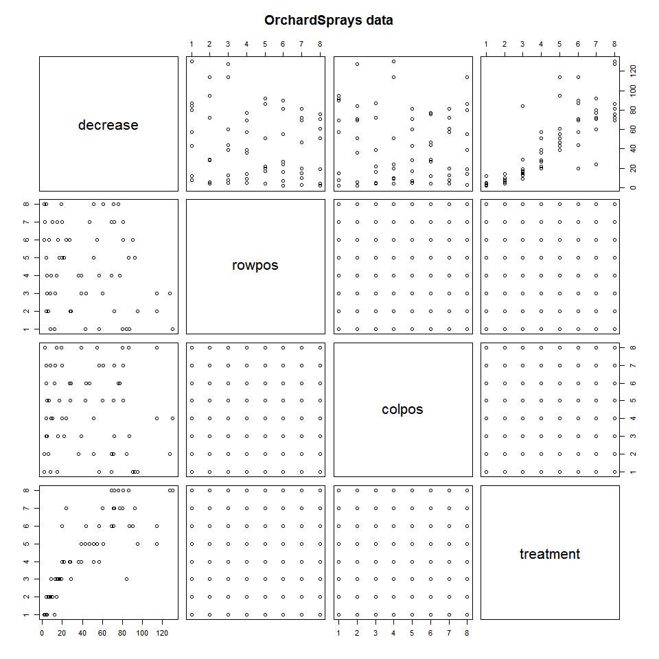
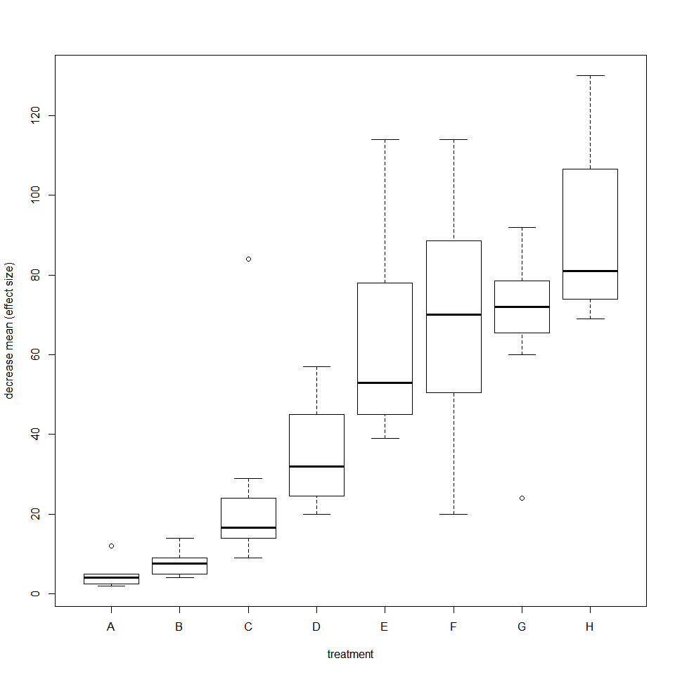
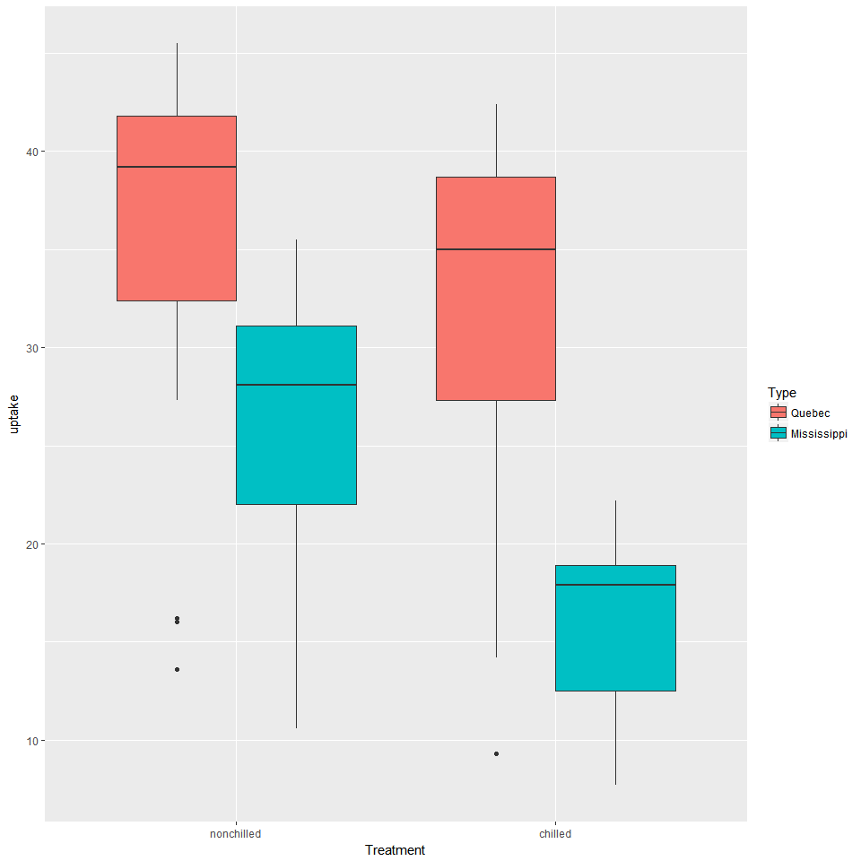

# NRE538_ANOVA
Oscar Feng-Hsun Chang  
Week5  


# One-way ANOVA

## Read-in data

Let's load the [OrchardSprays data](https://stat.ethz.ch/R-manual/R-devel/library/datasets/html/OrchardSprays.html) to demonstrate how different sprays (treatment) repel honeybees. 


```r
data(OrchardSprays)
head(OrchardSprays)
##   decrease rowpos colpos treatment
## 1       57      1      1         D
## 2       95      2      1         E
## 3        8      3      1         B
## 4       69      4      1         H
## 5       92      5      1         G
## 6       90      6      1         F
pairs(OrchardSprays, main = "OrchardSprays data")
```

<!-- -->

```r
str(OrchardSprays)
## 'data.frame':	64 obs. of  4 variables:
##  $ decrease : num  57 95 8 69 92 90 15 2 84 6 ...
##  $ rowpos   : num  1 2 3 4 5 6 7 8 1 2 ...
##  $ colpos   : num  1 1 1 1 1 1 1 1 2 2 ...
##  $ treatment: Factor w/ 8 levels "A","B","C","D",..: 4 5 2 8 7 6 3 1 3 2 ...
```

## Visualizing data

Let's first visualize the mean of each treatment (effect size) by plotting the box plot. 


```r
boxplot(decrease~treatment, data=OrchardSprays, xlab="treatment", ylab="decrease mean (effect size)")
```

<!-- -->

## Performaing ANOVA

There are multiple ways to do ANOVA


```r
spray.aov1 = aov(decrease~treatment, data=OrchardSprays)
spray.aov2.1 = lm(decrease~treatment, data=OrchardSprays)
spray.aov2.2 = lm(decrease~treatment-1, data=OrchardSprays)
```


```r
summary(spray.aov1)
```

```
##             Df Sum Sq Mean Sq F value  Pr(>F)    
## treatment    7  56160    8023   19.06 9.5e-13 ***
## Residuals   56  23570     421                    
## ---
## Signif. codes:  0 '***' 0.001 '**' 0.01 '*' 0.05 '.' 0.1 ' ' 1
```

```r
summary(spray.aov2.1)
```

```
## 
## Call:
## lm(formula = decrease ~ treatment, data = OrchardSprays)
## 
## Residuals:
##     Min      1Q  Median      3Q     Max 
## -49.000  -9.500  -1.625   3.812  58.750 
## 
## Coefficients:
##             Estimate Std. Error t value Pr(>|t|)    
## (Intercept)    4.625      7.253   0.638  0.52631    
## treatmentB     3.000     10.258   0.292  0.77101    
## treatmentC    20.625     10.258   2.011  0.04918 *  
## treatmentD    30.375     10.258   2.961  0.00449 ** 
## treatmentE    58.500     10.258   5.703 4.60e-07 ***
## treatmentF    64.375     10.258   6.276 5.39e-08 ***
## treatmentG    63.875     10.258   6.227 6.48e-08 ***
## treatmentH    85.625     10.258   8.347 2.08e-11 ***
## ---
## Signif. codes:  0 '***' 0.001 '**' 0.01 '*' 0.05 '.' 0.1 ' ' 1
## 
## Residual standard error: 20.52 on 56 degrees of freedom
## Multiple R-squared:  0.7044,	Adjusted R-squared:  0.6674 
## F-statistic: 19.06 on 7 and 56 DF,  p-value: 9.499e-13
```

```r
summary(spray.aov2.2)
```

```
## 
## Call:
## lm(formula = decrease ~ treatment - 1, data = OrchardSprays)
## 
## Residuals:
##     Min      1Q  Median      3Q     Max 
## -49.000  -9.500  -1.625   3.812  58.750 
## 
## Coefficients:
##            Estimate Std. Error t value Pr(>|t|)    
## treatmentA    4.625      7.253   0.638 0.526308    
## treatmentB    7.625      7.253   1.051 0.297663    
## treatmentC   25.250      7.253   3.481 0.000975 ***
## treatmentD   35.000      7.253   4.825 1.12e-05 ***
## treatmentE   63.125      7.253   8.703 5.47e-12 ***
## treatmentF   69.000      7.253   9.513 2.71e-13 ***
## treatmentG   68.500      7.253   9.444 3.49e-13 ***
## treatmentH   90.250      7.253  12.443  < 2e-16 ***
## ---
## Signif. codes:  0 '***' 0.001 '**' 0.01 '*' 0.05 '.' 0.1 ' ' 1
## 
## Residual standard error: 20.52 on 56 degrees of freedom
## Multiple R-squared:  0.8887,	Adjusted R-squared:  0.8728 
## F-statistic: 55.89 on 8 and 56 DF,  p-value: < 2.2e-16
```

* Try the above code and see what are the differences among them, especially the `spray.aov2.1` and `spray.aov2.2`.  
*hint:*  
What is the mean of decrease variable in each treatment?  
You can also try `model.tables(spray.aov1, "effects", se=TRUE)` to see what would happen. 

> `aov()` only returns whether the differences among treatments are significantly different.  
> `lm()` without -1 returns effects size model, so the estimate of each treatment is the difference of that treatment effects comparing to the first one (first treatment).  
> `lm()` with -1 returns the mean model, so the the estimate of each treatment is the mean effect size of that treatment.

## Reorder the level

When doing `lm()`, treatments are always being compared to the first one that goes into the linear model, and by default the level is ordered alphabetically. If we wish to compare each treatment not to the first treatment, we need to reorder the levels (treatments). For example, if we want to compare each treatment to treatment B instead of A, we have to do the following.


```r
OrchardSprays$treatment = factor(OrchardSprays$treatment, levels=(c("B", "A", "C", "D", "E", "F", "G", "H")))
spray.aov2.3 = lm(decrease~treatment, data=OrchardSprays)
summary(spray.aov2.3)
```

```
## 
## Call:
## lm(formula = decrease ~ treatment, data = OrchardSprays)
## 
## Residuals:
##     Min      1Q  Median      3Q     Max 
## -49.000  -9.500  -1.625   3.813  58.750 
## 
## Coefficients:
##             Estimate Std. Error t value Pr(>|t|)    
## (Intercept)    7.625      7.253   1.051  0.29766    
## treatmentA    -3.000     10.258  -0.292  0.77101    
## treatmentC    17.625     10.258   1.718  0.09128 .  
## treatmentD    27.375     10.258   2.669  0.00994 ** 
## treatmentE    55.500     10.258   5.411 1.35e-06 ***
## treatmentF    61.375     10.258   5.983 1.62e-07 ***
## treatmentG    60.875     10.258   5.935 1.94e-07 ***
## treatmentH    82.625     10.258   8.055 6.28e-11 ***
## ---
## Signif. codes:  0 '***' 0.001 '**' 0.01 '*' 0.05 '.' 0.1 ' ' 1
## 
## Residual standard error: 20.52 on 56 degrees of freedom
## Multiple R-squared:  0.7044,	Adjusted R-squared:  0.6674 
## F-statistic: 19.06 on 7 and 56 DF,  p-value: 9.499e-13
```

## Post-hoc test

One-way ANOVA only shows if the differences among treatments are significant. It does *NOT!* show how large the differences are.  
We have to perform post-hoc multiple comparison to see if certain treatment is significantly different from another. To do so, we will use [Tukey's honest significant differences](https://en.wikipedia.org/wiki/Tukey%27s_range_test), which is a t-test based statistical method to *simultaneously* calculate the confidence intervals of all pair-wise differences. By doing so, we can avoid the deflation of type-I error probability (i.e. declaring significant difference when it is not) when performing the traditional t-test multiple times. The Tukey's honest significant differences in R is `TukeyHSD()`. 


```r
TukeyHSD(spray.aov1)
```

```
##   Tukey multiple comparisons of means
##     95% family-wise confidence level
## 
## Fit: aov(formula = decrease ~ treatment, data = OrchardSprays)
## 
## $treatment
##       diff        lwr       upr     p adj
## B-A  3.000 -29.294313  35.29431 0.9999898
## C-A 20.625 -11.669313  52.91931 0.4842087
## D-A 30.375  -1.919313  62.66931 0.0795377
## E-A 58.500  26.205687  90.79431 0.0000123
## F-A 64.375  32.080687  96.66931 0.0000015
## G-A 63.875  31.580687  96.16931 0.0000018
## H-A 85.625  53.330687 117.91931 0.0000000
## C-B 17.625 -14.669313  49.91931 0.6756283
## D-B 27.375  -4.919313  59.66931 0.1540608
## E-B 55.500  23.205687  87.79431 0.0000357
## F-B 61.375  29.080687  93.66931 0.0000044
## G-B 60.875  28.580687  93.16931 0.0000052
## H-B 82.625  50.330687 114.91931 0.0000000
## D-C  9.750 -22.544313  42.04431 0.9793381
## E-C 37.875   5.580687  70.16931 0.0111133
## F-C 43.750  11.455687  76.04431 0.0018729
## G-C 43.250  10.955687  75.54431 0.0021935
## H-C 65.000  32.705687  97.29431 0.0000012
## E-D 28.125  -4.169313  60.41931 0.1316222
## F-D 34.000   1.705687  66.29431 0.0323055
## G-D 33.500   1.205687  65.79431 0.0368008
## H-D 55.250  22.955687  87.54431 0.0000390
## F-E  5.875 -26.419313  38.16931 0.9990714
## G-E  5.375 -26.919313  37.66931 0.9994801
## H-E 27.125  -5.169313  59.41931 0.1621616
## G-F -0.500 -32.794313  31.79431 1.0000000
## H-F 21.250 -11.044313  53.54431 0.4453236
## H-G 21.750 -10.544313  54.04431 0.4150331
```

* Challenge yourself! What is the probability to commit type I error if one is using t-test instead of ANOVA? Say three groups are being compared, and there's only one group (it can be either one or specific one) that is truely different from others. 

# ANOVA for factorial design

## Read-in data

Let's load the [CO2](https://stat.ethz.ch/R-manual/R-devel/library/datasets/html/zCO2.html) to demonstrate the experimental design where two different treatments are implemented. 


```r
data(CO2)
head(CO2, 10)
##    Plant   Type  Treatment conc uptake
## 1    Qn1 Quebec nonchilled   95   16.0
## 2    Qn1 Quebec nonchilled  175   30.4
## 3    Qn1 Quebec nonchilled  250   34.8
## 4    Qn1 Quebec nonchilled  350   37.2
## 5    Qn1 Quebec nonchilled  500   35.3
## 6    Qn1 Quebec nonchilled  675   39.2
## 7    Qn1 Quebec nonchilled 1000   39.7
## 8    Qn2 Quebec nonchilled   95   13.6
## 9    Qn2 Quebec nonchilled  175   27.3
## 10   Qn2 Quebec nonchilled  250   37.1
str(CO2)
## Classes 'nfnGroupedData', 'nfGroupedData', 'groupedData' and 'data.frame':	84 obs. of  5 variables:
##  $ Plant    : Ord.factor w/ 12 levels "Qn1"<"Qn2"<"Qn3"<..: 1 1 1 1 1 1 1 2 2 2 ...
##  $ Type     : Factor w/ 2 levels "Quebec","Mississippi": 1 1 1 1 1 1 1 1 1 1 ...
##  $ Treatment: Factor w/ 2 levels "nonchilled","chilled": 1 1 1 1 1 1 1 1 1 1 ...
##  $ conc     : num  95 175 250 350 500 675 1000 95 175 250 ...
##  $ uptake   : num  16 30.4 34.8 37.2 35.3 39.2 39.7 13.6 27.3 37.1 ...
##  - attr(*, "formula")=Class 'formula'  language uptake ~ conc | Plant
##   .. ..- attr(*, ".Environment")=<environment: R_EmptyEnv> 
##  - attr(*, "outer")=Class 'formula'  language ~Treatment * Type
##   .. ..- attr(*, ".Environment")=<environment: R_EmptyEnv> 
##  - attr(*, "labels")=List of 2
##   ..$ x: chr "Ambient carbon dioxide concentration"
##   ..$ y: chr "CO2 uptake rate"
##  - attr(*, "units")=List of 2
##   ..$ x: chr "(uL/L)"
##   ..$ y: chr "(umol/m^2 s)"
```

As you can see, there are 3 factors, plant individual (Plant), origin of the plant (Type), treatment (chilled or nonchilled), and ambient CO2 concentration (conc). There is also a measurement (uptake) We can use anova to investigate if treatment and the origin of the plant have effects on the CO2 uptake rate. Let's ignore the potential influences of plant individual and ambient CO2 concentration for now. We will revisit these influences later as they belong to the topics of random effects and ANCOVA.  

## Visualizing data

Let's take a look of the mean uptake rate of each group (Treatment X Type).

<!-- -->

## Performing two-way ANOVA

We now used the following argument to compare the uptake rate in different treatments and different type simultaneously. 


```r
CO2.aov = aov(uptake~Treatment + Type, data = CO2)
summary(CO2.aov)
```

```
##             Df Sum Sq Mean Sq F value   Pr(>F)    
## Treatment    1    988     988   14.95 0.000222 ***
## Type         1   3366    3366   50.92 3.68e-10 ***
## Residuals   81   5353      66                     
## ---
## Signif. codes:  0 '***' 0.001 '**' 0.01 '*' 0.05 '.' 0.1 ' ' 1
```

---------------------------------------------------------------------------------------------------------------------------------

__Exercise 1__  
Extract the effect size of each factor (i.e. Treatment and Type) with `$`. Make sure that you comment on the results (e.g. what do those numbers means and how do you know that?).


__Exercise 2 (Bonus!)__  
I've showed you one of multiple ways to do this two way ANOVA. Can you do it with `lm()` function and summarize and interpret the output table? This has something to do with interaction and the fact the those "Estimates" are actually regression coefficients.


---------------------------------------------------------------------------------------------------------------------------------

## Post-hoc test

Similarly, we used the following argument to post-hoc multiple comparison.  


```r
TukeyHSD(CO2.aov)
```

```
##   Tukey multiple comparisons of means
##     95% family-wise confidence level
## 
## Fit: aov(formula = uptake ~ Treatment + Type, data = CO2)
## 
## $Treatment
##                         diff       lwr       upr     p adj
## chilled-nonchilled -6.859524 -10.38928 -3.329771 0.0002218
## 
## $Type
##                         diff       lwr       upr p adj
## Mississippi-Quebec -12.65952 -16.18928 -9.129771     0
```

## Some notes

`summary(aov())` is equivalent to `anova(lm())`. They are used to calculate if the differences among treatments (effects size of each treatment) are significant.  
`summary(lm())` is equivalent to `smmary.lm(aov())`. They are used to estimate the effect size of each treatment.  

# Non-parametric one-way ANOVA

[Kruskal–Wallis test](https://en.wikipedia.org/wiki/Kruskal%E2%80%93Wallis_one-way_analysis_of_variance) can be used if the sample distribution is not normal. The arguments are similar to `aov()` or `lm()`. However, the Kruskal-Wallis test can only be used in one-way ANOVA!


```r
kruskal.test(uptake~Treatment, data = CO2)
```

```
## 
## 	Kruskal-Wallis rank sum test
## 
## data:  uptake by Treatment
## Kruskal-Wallis chi-squared = 7.4703, df = 1, p-value = 0.006272
```

The associated post-hoc test can be the Dunn's test, `dunn.test()` in the [`dunn.test`](https://cran.r-project.org/web/packages/dunn.test/dunn.test.pdf) package or its wrapper, `dunnTest()` in the [`FSA`](http://derekogle.com/fishR/packages) package. The usage are as follow. 


```r
library(dunn.test)
dunn.test(CO2$uptake, CO2$Treatment, method="bonferroni")
```

```
##   Kruskal-Wallis rank sum test
## 
## data: x and group
## Kruskal-Wallis chi-squared = 7.4703, df = 1, p-value = 0.01
## 
## 
##                            Comparison of x by group                            
##                                  (Bonferroni)                                  
## Col Mean-|
## Row Mean |   nonchill
## ---------+-----------
##  chilled |   2.733187
##          |     0.0031
```
* Since we only have two groups in Treatment and Type, it is basically the [Mann-Whitney U test](https://en.wikipedia.org/wiki/Mann%E2%80%93Whitney_U_test). That is to say, we have to specify the method to `bonferroni`, the most basic adjustment when comparing multiple groups. Other adjustment methods would work for more than two groups. The following are examples of using other adjustment methods. 

> If more than two treatments are being compared, there are not much options to deal with perform non-parametric multi-way ANOVA. We might have to resort to the resampling method to build our own non-parametric test.
