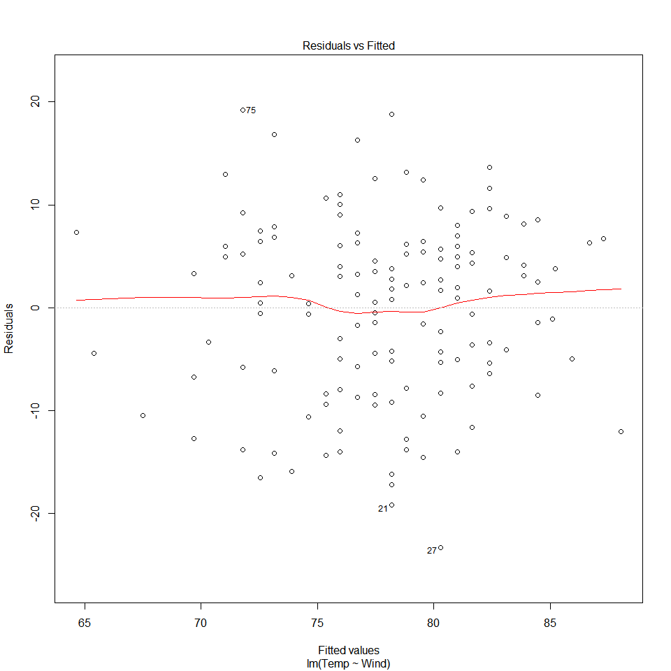

# NRE538_Linear regression
Oscar Feng-Hsun Chang  
Week7 and 8  

\newcommand\expect[1]{\mathbb{E}\left[{#1}\right]}
\newcommand\var[1]{\mathrm{Var}\left[{#1}\right]}


Let use [air quality data in New York](https://stat.ethz.ch/R-manual/R-devel/library/datasets/html/airquality.html) to demonstrate today's topics.


```r
data("airquality")
head(airquality, 15)
```

```
##    Ozone Solar.R Wind Temp Month Day
## 1     41     190  7.4   67     5   1
## 2     36     118  8.0   72     5   2
## 3     12     149 12.6   74     5   3
## 4     18     313 11.5   62     5   4
## 5     NA      NA 14.3   56     5   5
## 6     28      NA 14.9   66     5   6
## 7     23     299  8.6   65     5   7
## 8     19      99 13.8   59     5   8
## 9      8      19 20.1   61     5   9
## 10    NA     194  8.6   69     5  10
## 11     7      NA  6.9   74     5  11
## 12    16     256  9.7   69     5  12
## 13    11     290  9.2   66     5  13
## 14    14     274 10.9   68     5  14
## 15    18      65 13.2   58     5  15
```

# Correlation

Correlation is invariant to which variable is X and which varaible is Y. It describes how the two variables vary together in a linear fashion. 

## correlation plots

We can first use `pairs()` to create a series of correlation plots for a any two variables.


```r
pairs(airquality[, c("Ozone", "Solar.R", "Wind", "Temp")])
```

<!-- -->

## Pearson correlatin coefficient

We can calculate the correlation coefficient all at once by using `cor()`. 


```r
cor(airquality[, c("Ozone", "Solar.R", "Wind", "Temp")], use="na.or.complete")
```

```
##              Ozone    Solar.R       Wind       Temp
## Ozone    1.0000000  0.3483417 -0.6124966  0.6985414
## Solar.R  0.3483417  1.0000000 -0.1271835  0.2940876
## Wind    -0.6124966 -0.1271835  1.0000000 -0.4971897
## Temp     0.6985414  0.2940876 -0.4971897  1.0000000
```

Note that the Pearson correlation coefficient (r) will not be affected by rescaling of the data. Can you explain why? Think about how do you caalculate correlation coefficient.  

## Linear association ONLY

Correlation is only used to investigatet the <span style="color:red">_linear association_</span> between two variables. There it could be misleading if you don't plot the two variables to see if the two variables are really correlated with each other.  

Let's do a small experiment. Run the following chunk of code and you should have 2 vectors (y1 and y2) each containing 1200 numbers


```r
set.seed(15165)
f = function(x){
 y=-(x+3)^2 + runif(length(x), min=-2, max=2)
 #print(y)
}
f1 = function(x){
  y=runif(length(x), min=min(x), max=max(x))
}

x=seq(from=-6, to=0, by =0.005)
y1=f(x)
y2=f1(x)
```

Showing the first 20 numbers (`head(variable, 20)`) you should be able to see the following numbers in x, y1, and y2. 


```
##  [1] -6.000 -5.995 -5.990 -5.985 -5.980 -5.975 -5.970 -5.965 -5.960 -5.955
## [11] -5.950 -5.945 -5.940 -5.935 -5.930 -5.925 -5.920 -5.915 -5.910 -5.905
```

```
##  [1]  -9.323315  -7.366830  -9.337316  -9.144857  -7.693030 -10.747985
##  [7]  -9.299000  -8.526552  -8.211657  -9.204908  -9.960874  -9.300977
## [13]  -8.701628  -8.658365 -10.102105  -8.445057 -10.149139  -8.867093
## [19]  -7.755224  -7.803386
```

```
##  [1] -3.7423257 -3.8325634 -4.9161171 -0.4329980 -1.6011408 -1.2472216
##  [7] -1.5168698 -5.7254827 -1.9010040 -4.2333970 -1.2509750 -0.2208327
## [13] -1.5939552 -1.1852458 -2.6486452 -0.8834251 -0.9365257 -5.5812074
## [19] -1.7773214 -1.5103962
```

Calculate the correlation coefficient between y1 and x as well as y2 and x by using `cor(variable1, variable2)`. You should see following two pretty small correlation coefficients. 


```
## [1] 2.843496e-05
```

```
## [1] 0.03969688
```

Now plot the y1 vs x and y2 vs x to see the relationship between them.

<!-- --><!-- -->

Now you see that although y1 and y2 all have near 0 correlation coefficient with x, but actually y1 and x are related in a _nonlinear_ way. 

---------------------------------------------------------------------------------------------------------------------------------

__Exercise 1__

Try to plot and calculate the correlation coefficients between the waiting time between eruptions and the duration of the eruption for the Old Faithful geyser in Yellowstone National Park. The dataset is built in R named [faithful](https://stat.ethz.ch/R-manual/R-devel/library/datasets/html/faithful.html). 


---------------------------------------------------------------------------------------------------------------------------------

## Correlation $\neq$ Causality

# Regression

In smiple linear regression (the simplest case of regression), the goal is to be able to predict an expected value of Y variable with any given X value. The regression line to basically connecting these expected values to form a straight line. These expected Y value should be as close to each observed Y value as possible. The method we used to calculate the distance between observed Y values and the expected Y value is called [_Residual Sum of Square_ (RSS)](https://en.wikipedia.org/wiki/Residual_sum_of_squares).   

$$RSS = \sum_{i=1}^n (y_i - \expect{y}\ )^2 = \sum_{i=1}^n (y_i - f(x_i))^2 = \sum_{i=1}^n (y_i - (\alpha + \beta x_i))^2$$

The method to find $\alpha$ and $\beta$ to minimize $SSE$ is so called the [Ordinary Least Squares (OLS)](https://en.wikipedia.org/wiki/Ordinary_least_squares) method. The OLS method is actually a Maximum Likelihood Estimate (MLE) if the response variable (or dependent variable; Y) follows normal distribution. The mathematical deduction is [here](https://github.com/OscarFHC/NRE538_GSRA/blob/master/Labs/NRE538_lm/MLE_OLS.pdf), if you are interested in... 

## Linear model

Let's use the airquality data to perform linear regression in __R__ by using `lm()`. 


```r
mod = lm(Temp~Wind, data=airquality)
summary(mod)
```

```
## 
## Call:
## lm(formula = Temp ~ Wind, data = airquality)
## 
## Residuals:
##     Min      1Q  Median      3Q     Max 
## -23.291  -5.723   1.709   6.016  19.199 
## 
## Coefficients:
##             Estimate Std. Error t value Pr(>|t|)    
## (Intercept)  90.1349     2.0522  43.921  < 2e-16 ***
## Wind         -1.2305     0.1944  -6.331 2.64e-09 ***
## ---
## Signif. codes:  0 '***' 0.001 '**' 0.01 '*' 0.05 '.' 0.1 ' ' 1
## 
## Residual standard error: 8.442 on 151 degrees of freedom
## Multiple R-squared:  0.2098,	Adjusted R-squared:  0.2045 
## F-statistic: 40.08 on 1 and 151 DF,  p-value: 2.642e-09
```

* What does this summary table tell you?

We can plot the temperature against wind and the estimated regression line (red line).


```r
plot(Temp~Wind, data=airquality)
abline(lm(Temp~Wind, data=airquality), col="red")
```

<!-- -->

---------------------------------------------------------------------------------------------------------------------------------

__Exercise 2__

1. Build another linear model with another independent variable, Ozone, and plot it with estimated regression line. 


2. Build a linear model to explain if you see longer eruption time if you wait for longer. 


```r
mod.faith = lm(eruptions~waiting, data=faithful)
summary(mod.faith)
```

```
## 
## Call:
## lm(formula = eruptions ~ waiting, data = faithful)
## 
## Residuals:
##      Min       1Q   Median       3Q      Max 
## -1.29917 -0.37689  0.03508  0.34909  1.19329 
## 
## Coefficients:
##              Estimate Std. Error t value Pr(>|t|)    
## (Intercept) -1.874016   0.160143  -11.70   <2e-16 ***
## waiting      0.075628   0.002219   34.09   <2e-16 ***
## ---
## Signif. codes:  0 '***' 0.001 '**' 0.01 '*' 0.05 '.' 0.1 ' ' 1
## 
## Residual standard error: 0.4965 on 270 degrees of freedom
## Multiple R-squared:  0.8115,	Adjusted R-squared:  0.8108 
## F-statistic:  1162 on 1 and 270 DF,  p-value: < 2.2e-16
```

---------------------------------------------------------------------------------------------------------------------------------

## Errors

How can we find the error that is being mininized then?  
It's the square of the _Residual standrd error (RSE)_ in the summary table. This value is calculated by the following:

$$\sqrt{\frac{\sum_i\!\hat{\varepsilon_i}^2} {df}}$$, where $\hat{\varepsilon_i}$ is the residual and the $df$ is the degree of freedom of residuals. 
 
We can also calculate it manually.  
First, we need each _residual (res)_.  
The sum of squared residuals is _Residual Sum of Square (RSS)_.  
Square root of `RSS` divied by the degree of freedom of residuals is the _Residual standrd error (RSE)_.


```r
res = residuals(mod)
RSS = sum(res^2)
RSE = sqrt(RSS/summary(mod)$df[2])
```

Note that the RSS calculated here can also be used to calculate the RMSE (root mean square error) you read in the text book and the mean square error (MSE).


```r
RMSE = RSS/153
RMSE
```

```
## [1] 70.33655
```

```r
MSE = RSS/summary(mod)$df[2]
MSE
```

```
## [1] 71.26816
```

We can also use anova table to confirm the MSE we manually calculated is correct. 


```r
anova(mod)
```

```
## Analysis of Variance Table
## 
## Response: Temp
##            Df  Sum Sq Mean Sq F value    Pr(>F)    
## Wind        1  2856.4 2856.39   40.08 2.642e-09 ***
## Residuals 151 10761.5   71.27                      
## ---
## Signif. codes:  0 '***' 0.001 '**' 0.01 '*' 0.05 '.' 0.1 ' ' 1
```

* What are these "errors" mean?  

You should notice that residual standard error (RSE) is the square root of MSE. Yes, your speculation is correct. This relationship is resemble to that between standard deviation and variance. MSE is the variance of all the residuals and residual standard error is the standard deviation of residuals. Both are the [unbiased estimators](https://en.wikipedia.org/wiki/Bias_of_an_estimator) of residuals, because they are divided by the degree of freedom of residuals. However, the RMSE is the biased estimation of residual variance. 

---------------------------------------------------------------------------------------------------------------------------------

__Exercise 3__

Calculat the residual standard error (RSE) and mean square error (MSE) *manually* for the model you built last time (Ozone as the independent variable).


---------------------------------------------------------------------------------------------------------------------------------

## Goodness of fit

After fitting a line to the data, our next question would be "how good this linear model is".   

### $R^2$

The first thing we can do is to see how much of the variance is being explained by the indpendent variables we put in the model, so the $R^2$. $R^2$ is calculated as follow.  

$$R^2=1-\frac{\var{\hat{\varepsilon}}}{\var{y}}=1-\frac{\sum_i\!\hat{\varepsilon_i}^2/(n-1)}{\sum_i\!(y_i-\bar{y})^2/(n-1)}$$  
Here $\var{\hat{\varepsilon}}$ is the variance of residuals and the $\var{y}$ is the variance of the dependent variable. 


```r
SSY = deviance(lm(airquality$Temp~1))
SSY1 = var(airquality$Temp)*152
R2 = 1 - RSS/SSY
SSY
```

```
## [1] 13617.88
```

```r
SSY1
```

```
## [1] 13617.88
```

```r
R2
```

```
## [1] 0.2097529
```

$R^2$ gives us an idea how much variance is being explained by the independent variable (x). We also need to know if this amount of variance is significantly different from 0. This is the significance of the model, or the significance of the independent variable if there is only one independent variable.  

In addition, in the summary table there is another slightly different adjusted $R^2$. This is $R^2$ adjusted by the number of parameter estimated (independent variable plus intercept term in the model). The formula is as follow.

$$\bar{R}^2 = 1-\frac{\sum_i\!\hat{\varepsilon_i}^2/(n-k)}{\sum_i\!(y_i-\bar{y})^2/(n-1)}$$  
Here, $\bar{y}$ is the mean of the data, $n$ is the number of data, and $k$ is the number of parameters estimated.

---------------------------------------------------------------------------------------------------------------------------------

__Exercise 4__

Calculate the adjust $R^2$ manually.


---------------------------------------------------------------------------------------------------------------------------------

These errors are also being used in testing whether the model is significant. This is done by calculating the _F_-value. Recall from the ANOVA session, _F_-distribution describes the distribution of ratio of treatment variance (total variance - residual variance) and residual variance (i.e. MSE we calculated above). We also need the degree of freedom (df) for this _F_-distribution. They are the degree of freedom of treatmentand the degree of freedom of residual.  
- Df of treatment is 1 here because we have only one independent variable.  
- Df of residual is 151 because the total df is 152 (there are 153 values in total) minus df of treatment (1). 

```r
F = ((SSY-RSS)/1)/MSE
1-pf(F, df1=1, df2=summary(mod)$df[2])
```

```
## [1] 2.641597e-09
```
* try `?pf()` to understand what I did here. 

### Model checking

#### Independent of residuals each other, which implies lack of correlation

Test for autocorrelation among residuals are especially important in time series data. The data we are now dealing with is a time series data! Since we did not do any manipulation to the data, residuals are highly possible to fail the autocorrelation test.  


```r
plot(residuals(mod))
```

<!-- -->

There exists a clear pattern, which indicates that the residuals are indeed autocorrelated.  
We can use the [Durbin-Watson statistic](https://en.wikipedia.org/wiki/Durbin%E2%80%93Watson_statistic) to detect the existence of autocorrelation. This test is basically regress error in time (t) on error in time (t-1). 


```r
#install.packages(lmtest)
library(lmtest)
dwtest(mod, alternative=c("two.sided"))
```

```
## 
## 	Durbin-Watson test
## 
## data:  mod
## DW = 0.69314, p-value = 3.187e-16
## alternative hypothesis: true autocorrelation is not 0
```

Not supprisingly, the residuals show a clear temporal autocorrelation. This means we should manipulate the data (e.g. detrend or remove seasonality) before doing the linear regression. 

#### Constant variance of residuals

We next inspect the distribution of the variance of residuals to see if there is any structured pattern in the variance of residuals.  
Let's plot the residuals against the fitted values. 


```r
plot(residuals(mod)~fitted(mod))
abline(lm(residuals(mod)~fitted(mod)), col="red")
```

<!-- -->

* This can also be done by `plot(mod, which=c(1))`. Try it. 

This plot can give us an idea of whether the residuals have constant variance (i.e. [homoscedasticity](https://en.wikipedia.org/wiki/Homoscedasticity)). If yes, the varaince should distributed evenly in the plot. In general, we do not want to see the residuals increase or decrease with the increase of fitted value. 

There is also a test to examine homoscedasticity (or heteroscedasticity in the opposit sense).


```r
#install.packages(lmtest)
library(lmtest)
bptest(mod)
```

```
## 
## 	studentized Breusch-Pagan test
## 
## data:  mod
## BP = 2.2971, df = 1, p-value = 0.1296
```

The results show that the residuals are homoscedastic, which is good. 

#### Normal distributed residuals

Remember the QQ plot and the shapiro-wilk test we used before to check for normality? We need them to examine if the residuals follow normal distribution here. 


```r
qqnorm(residuals(mod))
qqline(residuals(mod), col="red")
```

<!-- -->

* Try `plot(mod, which=c(2))` to produce the same plot. 


```r
shapiro.test(residuals(mod))
```

```
## 
## 	Shapiro-Wilk normality test
## 
## data:  residuals(mod)
## W = 0.98431, p-value = 0.07999
```

From the QQ plot and the shapiro-wilk test, we can say that the residuals are normally distributed. That's nice. 

The above three inspections tell us that this linear model performs fairly well if temporal autocorrelation issue had been taken care of.

> Always check!  
> 1. <span style="color:red"> residual independency (possibly with the `dwtest`) </span>  
> 2. <span style="color:red"> residual homoscedasticity (possibly with the `bptest`) </span>  
> 3. <span style="color:red"> residual normality (possibly with the `shapiro.test`)</span>  
  
#### Other plots to investigate the linear model

We can "plot the model" to see other plots that allows us to check the model


```r
plot(mod)
```

<!-- --><!-- --><!-- --><!-- -->

Note that the first two are the ones we have seen before. 

---------------------------------------------------------------------------------------------------------------------------------

__Exercise 5__

Check residual independency, homoscedasticity, and normality for the model with ozone as the independent variable and interpret the results briefly.


---------------------------------------------------------------------------------------------------------------------------------
