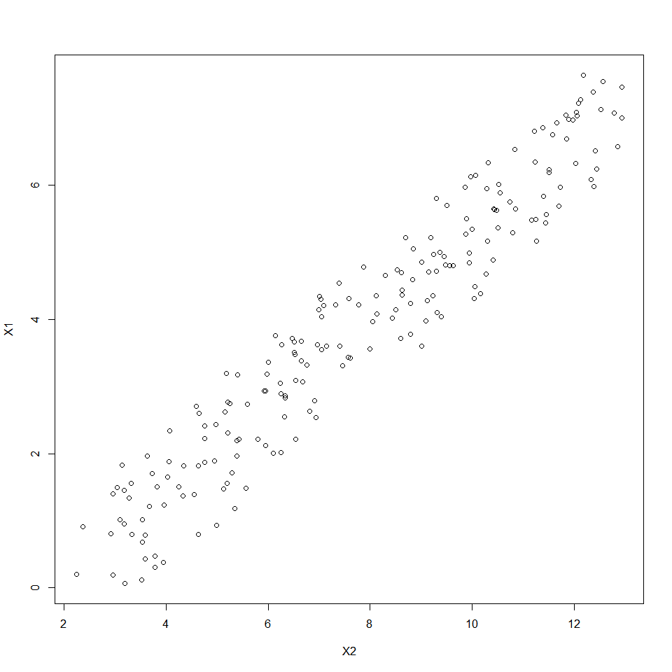
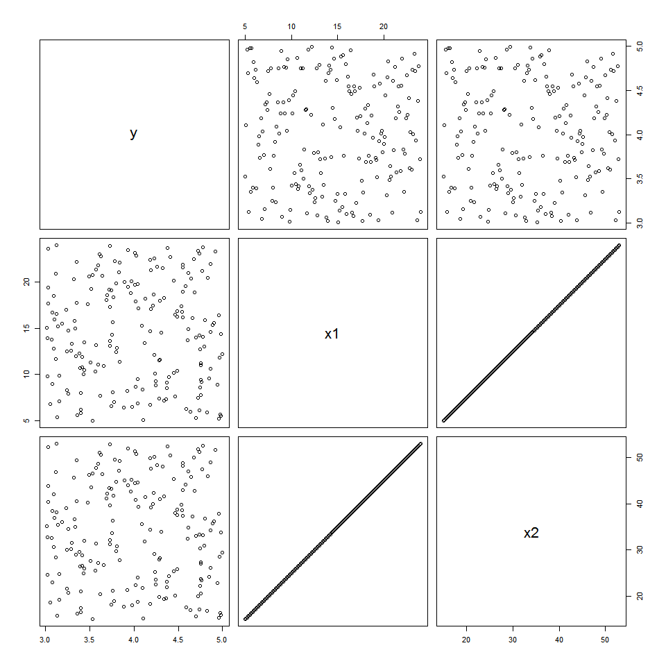

# NRE538_Multiple Linear Regression
Oscar Feng-Hsun Chang  
Week9  

\newcommand\expect[1]{\mathbb{E}\left[{#1}\right]}
\newcommand\var[1]{\mathrm{Var}\left[{#1}\right]}


Let use [air quality data in New York](https://stat.ethz.ch/R-manual/R-devel/library/datasets/html/airquality.html) to demonstrate today's topics.


```r
data("airquality")
head(airquality, 15)
```

```
##    Ozone Solar.R Wind Temp Month Day
## 1     41     190  7.4   67     5   1
## 2     36     118  8.0   72     5   2
## 3     12     149 12.6   74     5   3
## 4     18     313 11.5   62     5   4
## 5     NA      NA 14.3   56     5   5
## 6     28      NA 14.9   66     5   6
## 7     23     299  8.6   65     5   7
## 8     19      99 13.8   59     5   8
## 9      8      19 20.1   61     5   9
## 10    NA     194  8.6   69     5  10
## 11     7      NA  6.9   74     5  11
## 12    16     256  9.7   69     5  12
## 13    11     290  9.2   66     5  13
## 14    14     274 10.9   68     5  14
## 15    18      65 13.2   58     5  15
```

```r
airquality = airquality %>%
  subset(is.na(Solar.R)==FALSE & is.na(Ozone)==FALSE)
```

# Recap

- Correlation describes whether there is "interdependence" between two variables.
- Regression is to find the best model to relate the response variables (Y) to the explanatory variables, so that we can estimate  the model parameters for making inferences or forcasting. 

# Multiple Regression

Last time, we only deal with one explanatory variable (X). If we want to know how the response variable (Y) can be explained by multiple explanatory variable, we will have to do multiple regression

## Collinearity 

First thing is to know what explanatory variables should be included in the model.  
The most important thing is to know your system and decide what should be included. This is where explanatory data analysis is important. 

### useful `pair()` function 

The `pair()` function allows you to have a glimpse of the relationship among the variables. 


```r
pairs(airquality[,c(1:4)], lower.panel=panel.lm, upper.panel=panel.cor)
```

<!-- -->

### `cor()` function 

Correlation coefficients can also be calculated to help you understand the linear dependency among each variable. 


```r
cor(airquality[,c(1:4)], use="na.or.complete")
```

```
##              Ozone    Solar.R       Wind       Temp
## Ozone    1.0000000  0.3483417 -0.6124966  0.6985414
## Solar.R  0.3483417  1.0000000 -0.1271835  0.2940876
## Wind    -0.6124966 -0.1271835  1.0000000 -0.4971897
## Temp     0.6985414  0.2940876 -0.4971897  1.0000000
```

In general, we don't want the explanatory varaibles in the model to be higly correlated. Otherwise it will bias the estimates of the regresion coefficients of explanaroty variables.  

Take a look of the following simple example that demonstrate the impact of having highly correlated explanatory variables.  
First we use a known $Y$ to generate two $X$ variables, so that we know what are the true relationship between $X$ and $Y$ and what the regression coefficients should be.  
Specifically, I have 201 $Y$ values evenly ranged from 0 to 20. I generated $X_1$ by the formula, $Y = 3X_1 + 2 + noise$, so that the regression coefficient of $Y$ on $X_1$ should be around 3. Similarily, I generated $X_2$ by a different formula, $Y = 2X_2 - 3 + noise$, so that the regression coefficient of $Y$ on $X_2$ should be around 2. 


```r
Y = seq(from=0, to=20, by=0.1)
X1 = (Y-2)/3 + runif(length(Y), min=0.5, max=2)
X2 = (Y+3)/2 + runif(length(Y), min=0.5, max=2)
df = as.data.frame(cbind(Y, X1, X2))
summary(lm(Y~X1, data=df))
```

```
## 
## Call:
## lm(formula = Y ~ X1, data = df)
## 
## Residuals:
##      Min       1Q   Median       3Q      Max 
## -2.60032 -1.01432 -0.07375  1.04872  2.11966 
## 
## Coefficients:
##             Estimate Std. Error t value Pr(>|t|)    
## (Intercept) -1.22530    0.20036  -6.115 5.01e-09 ***
## X1           2.90135    0.04624  62.745  < 2e-16 ***
## ---
## Signif. codes:  0 '***' 0.001 '**' 0.01 '*' 0.05 '.' 0.1 ' ' 1
## 
## Residual standard error: 1.279 on 199 degrees of freedom
## Multiple R-squared:  0.9519,	Adjusted R-squared:  0.9516 
## F-statistic:  3937 on 1 and 199 DF,  p-value: < 2.2e-16
```

```r
summary(lm(Y~X2, data=df))
```

```
## 
## Call:
## lm(formula = Y ~ X2, data = df)
## 
## Residuals:
##      Min       1Q   Median       3Q      Max 
## -1.61715 -0.72480  0.04409  0.74314  1.58877 
## 
## Coefficients:
##             Estimate Std. Error t value Pr(>|t|)    
## (Intercept) -5.19773    0.17519  -29.67   <2e-16 ***
## X2           1.95850    0.02112   92.72   <2e-16 ***
## ---
## Signif. codes:  0 '***' 0.001 '**' 0.01 '*' 0.05 '.' 0.1 ' ' 1
## 
## Residual standard error: 0.8771 on 199 degrees of freedom
## Multiple R-squared:  0.9774,	Adjusted R-squared:  0.9773 
## F-statistic:  8598 on 1 and 199 DF,  p-value: < 2.2e-16
```

So far so good. But if we what to have both $X_1$ and $X_2$ in the linear regression model, the regression coefficients for both $X_1$ and $X_2$ are way off the true values. This is because $X_1$ and $X_2$ are highly correlated, which we can see from the correlation plot the correlation coefficient between $X_1$ and $X_2$. 


```r
summary(lm(Y~X1+X2, data=df))
```

```
## 
## Call:
## lm(formula = Y ~ X1 + X2, data = df)
## 
## Residuals:
##      Min       1Q   Median       3Q      Max 
## -1.50123 -0.44709 -0.05838  0.44928  1.48399 
## 
## Coefficients:
##             Estimate Std. Error t value Pr(>|t|)    
## (Intercept) -4.08572    0.16248  -25.15   <2e-16 ***
## X1           1.02257    0.08509   12.02   <2e-16 ***
## X2           1.30536    0.05669   23.03   <2e-16 ***
## ---
## Signif. codes:  0 '***' 0.001 '**' 0.01 '*' 0.05 '.' 0.1 ' ' 1
## 
## Residual standard error: 0.6686 on 198 degrees of freedom
## Multiple R-squared:  0.9869,	Adjusted R-squared:  0.9868 
## F-statistic:  7469 on 2 and 198 DF,  p-value: < 2.2e-16
```

```r
plot(X1~X2)
```

<!-- -->

```r
cor(X1, X2)
```

```
## [1] 0.9588077
```

---------------------------------------------------------------------------------------------------------------------------------

__Exercise 1__

Manipulate the above code to reduce the correlation between $X_1$ and $X_2$ and recalculate the regression coefficients. Explain what you find. 

*hint:* Increase the random noise of $X_1$ and $X_2$ so that the two can be less correlated.


---------------------------------------------------------------------------------------------------------------------------------

In the worst case, if two explanatory varaibles are perfectly correlated, regression coefficients can not be estimates. Take the following creative case for example...


```r
y=seq(from=1, to=20, by=0.1)
y=runif(length(y), min=3, max=5)
x1=seq(from=5, to=24, by=0.1)
x2=x1*2+5
df = data.frame(y, x1, x2)
pairs(df)
```

<!-- -->

```r
cor(df)
```

```
##              y          x1          x2
## y   1.00000000 -0.01801595 -0.01801595
## x1 -0.01801595  1.00000000  1.00000000
## x2 -0.01801595  1.00000000  1.00000000
```


We can see that when x1 and x2 are perfectly correlated, regression coefficients of one of them can not be estimated. This is a rather extreme and simple example that you might never encounter in your entire life, but it is worthy to be aware the this is due to the problem of [singularity](https://en.wikipedia.org/wiki/Singularity_(mathematics)) in matrix algebra. 

Another more formal way to diagnose how the magnitude of collinearity among explanatory variables is the [variance inflation factor (VIF)](https://en.wikipedia.org/wiki/Variance_inflation_factor).  

$$VIF_i = \frac{1}{1 -{R_i}^2}$$, where ${R_i}^2$ is the ${R}^2$ of the linear model with ${X_i}$ being the response variable (i.e. at the left side of the equation) and the other ${X_s}$ being the explanatory variables (at the right hand side of the equation).  
To the best of my knowledge, there is no built-in funciton that allows us to calculate VIF automatically, so we'll have to write our own...In fact, it's not hard to write. For example the VIF for radiation can be calculated as follow. 


```r
vif.rad = 1/(1 - summary(lm(Solar.R~Wind+Ozone, dat=airquality))$r.squared)
vif.rad
```

```
## [1] 1.153704
```

Generally we want the VIP to be smaller than 5 or 10 (some say 20). However, neither VIF or correlation coefficients or plots are not strick rules to determine whether a correlated variables should be discard from the model or not. They only alert you the potential bias that could result from collinearity. 

## Model comparision

### $F$-test

After deciding which explanatory variables to include in the model, the next step is to compare each model. A common way to compare the model is to do $F$-test. The concept of $F$-test is to compare the ability of the models to explain the varaiance of the response varaible. To do so, $F$-statistic is calculated by the following formula,

$$F = \frac {(\frac{RSS_1-RSS_2}{p_2-p_1})}{(\frac{RSS_2}{n-p_2})}\ ,$$

where $RSS_i$ is the residual sum of square of $model_i$, $p_i$ number of parameters in $model_i$, $n$ is the sample size. Basically, $n-p_i$ is the degree of freedom of $model_i$. The probability of this $F$-statistic in the $F$ distibution (with degree of freedom $p_2-p_1$ and $n-p_2$), is the probability for model 1 to explain same amount of variance with model 2. 

Let's compare the following two models with the Ozone data set.

$$Model_1: Temp = \beta_0 + \beta_1 * Wind + \epsilon_1$$

$$Model_2: Temp = \beta_0' + \beta_1' * Wind + + \beta_2' * Radiation + \epsilon_2$$

Here $Model_1$ is nested in $Model_2$, because if we let all levels of Radiation to have same effects on Temperature, we have $Model_1$. 


```r
mod1 = lm(Temp~Wind, data=airquality)
summary(mod1)
```

```
## 
## Call:
## lm(formula = Temp ~ Wind, data = airquality)
## 
## Residuals:
##     Min      1Q  Median      3Q     Max 
## -19.112  -5.646   1.014   6.254  18.888 
## 
## Coefficients:
##             Estimate Std. Error t value Pr(>|t|)    
## (Intercept)  91.0305     2.3489  38.754  < 2e-16 ***
## Wind         -1.3318     0.2226  -5.983 2.84e-08 ***
## ---
## Signif. codes:  0 '***' 0.001 '**' 0.01 '*' 0.05 '.' 0.1 ' ' 1
## 
## Residual standard error: 8.306 on 109 degrees of freedom
## Multiple R-squared:  0.2472,	Adjusted R-squared:  0.2403 
## F-statistic: 35.79 on 1 and 109 DF,  p-value: 2.842e-08
```

```r
mod2 = lm(Temp~Wind+Solar.R, data=airquality)
summary(mod2)
```

```
## 
## Call:
## lm(formula = Temp ~ Wind + Solar.R, data = airquality)
## 
## Residuals:
##      Min       1Q   Median       3Q      Max 
## -17.2714  -5.0237   0.5837   5.2545  18.4608 
## 
## Coefficients:
##              Estimate Std. Error t value Pr(>|t|)    
## (Intercept) 85.702275   2.925445  29.295  < 2e-16 ***
## Wind        -1.251870   0.217207  -5.763 7.89e-08 ***
## Solar.R      0.024533   0.008478   2.894  0.00461 ** 
## ---
## Signif. codes:  0 '***' 0.001 '**' 0.01 '*' 0.05 '.' 0.1 ' ' 1
## 
## Residual standard error: 8.039 on 108 degrees of freedom
## Multiple R-squared:  0.3014,	Adjusted R-squared:  0.2884 
## F-statistic: 23.29 on 2 and 108 DF,  p-value: 3.886e-09
```

Before comparison, one thing can be pointed out. The regression coefficient of wind in the two models change a little. This is because wind and radiation is not perfectly independent. You should be able to see the regression coefficient of radiation does change a little bit. 

Let's compare the two models. Since we know that it follows $F$ distribution, we use `anova()` function to perform the `F-test`. 


```r
anova(mod1, mod2)
```

```
## Analysis of Variance Table
## 
## Model 1: Temp ~ Wind
## Model 2: Temp ~ Wind + Solar.R
##   Res.Df    RSS Df Sum of Sq      F   Pr(>F)   
## 1    109 7520.7                                
## 2    108 6979.5  1    541.17 8.3739 0.004606 **
## ---
## Signif. codes:  0 '***' 0.001 '**' 0.01 '*' 0.05 '.' 0.1 ' ' 1
```

From the output table, we see that $RSS$ of _mod2_ is 6979.506 and the $RSS$ of _mod1_ is 7520.672. The $F$ statistic is 8.374. The interpretation of these results is that _mod2_ explains significantly greater amount of varaince comparing to _mod1_, because the probability for _mod1_ to explain the same amount of variance as _mod2_ is 0.004606. 

---------------------------------------------------------------------------------------------------------------------------------

__Exercise 2__ 

[Bonus, 2 pts] Challenge yourself by calculateing the $RSS$ of the two models, $F$ statistics (1 pt) and the p-value (1 pt) all by yourself (i.e. not using the `anova()` function)


1. Compare a third model (_mod3_) with ozone varaible as the third independent variable to _mod1_ and _mod2_ above. Does it explain more variance? Does it give you reasonable estimate of regressino coefficients?


---------------------------------------------------------------------------------------------------------------------------------

> <span style="color:red"> Important </span> 
> $F$-test can only be used to compare the "_nested_" models!

### Other methods of model comparision/selection

There are at least two other way to compare different models.  

1. Likelihood ratio test. This is very useful especially when comparing non linear models. However, like the $F$-test, the model will also need to be nested for a valid likelihood ratio test. Basically, it it calculating the maximum likelihood of different models, and take the ratio of the two. This ratio will follow $\chi^2$ distribution. Similarily, by finding the probability of observatin the ratio according to the $\chi^2$ distribution, we can know which model performs better. The performance of the model in this sense is not the amount of variance of response variable being explained, but the likelihood of the model to generate the observed data. The model that has higer probability is considered as the "better" model.  

2. [AIC](https://en.wikipedia.org/wiki/Akaike_information_criterion) value comparison. AIC is the informatino cirteria based on the maximum likelihood of the model. AIC is expecially useful when comparing non-nested models. The AIC can not give us an idea about how probable one model is comparing to another. Instead, it only informs which mode would loss less information while taking the number of parameters into account. Generally, the smaller the AIC is the less information is lossed (better performed model). The rule of thumb is that AIC difference greater than 10 can be considered as a significant difference, although there is not strict rules especially when AIC difference is 4-7. 

Many other [model comparision/selection](https://en.wikipedia.org/wiki/Model_selection) methods are available. However, they are beyond the scope of this class. 

---------------------------------------------------------------------------------------------------------------------------------

__Exercise 3__

Compare the AIC of the three models above _mod1_, _mod2_, and _mod3_. Do you have different conclusion in terms of which model performs better?


---------------------------------------------------------------------------------------------------------------------------------

## Ockham's razor

Paremeters should be used with parsimony in modeling, so that any parameter that does not significantly contribute to the model (e.g. increase the $R^2$ in an important way) should be eliminated. 


## Partial regresion coefficient

Let say we decide to use _mod2_ as the final model to explain the data. How do we interprete the regression coefficients?

The regression coefficient of Wind variable is the effect of Wind on Temperature when the effect of Radiation is being controlled for. 

This coefficient can also be calculated by the following linear regressin model.

$$Temp_{res|rad} = \beta_0 + \beta_1 Wind_{res|rad}\ ,$$

where $Temp_{res|rad}$ is the residuals of temperature regressed on radiation and $Wind_{res|rad}$ is the residuals of wind regressed on radiation. From the formula, we see that the effects of wind is estimated when taking the influences of radiation into account. 


```r
mod.r = lm(Temp~Solar.R, data=airquality)
mod.wr = lm(Wind~Solar.R, data=airquality)
summary(lm(residuals(mod.r)~residuals(mod.wr)))
```

```
## 
## Call:
## lm(formula = residuals(mod.r) ~ residuals(mod.wr))
## 
## Residuals:
##      Min       1Q   Median       3Q      Max 
## -17.2714  -5.0237   0.5837   5.2545  18.4608 
## 
## Coefficients:
##                     Estimate Std. Error t value Pr(>|t|)    
## (Intercept)        3.578e-16  7.595e-01    0.00        1    
## residuals(mod.wr) -1.252e+00  2.162e-01   -5.79 6.87e-08 ***
## ---
## Signif. codes:  0 '***' 0.001 '**' 0.01 '*' 0.05 '.' 0.1 ' ' 1
## 
## Residual standard error: 8.002 on 109 degrees of freedom
## Multiple R-squared:  0.2352,	Adjusted R-squared:  0.2282 
## F-statistic: 33.53 on 1 and 109 DF,  p-value: 6.874e-08
```

We see the estimated effect is -1.2518703 identical to the one estimated from the multiple regression (-1.2518703). This coefficient is the partical regression coefficient. 

Note that this is different from the following model.

$$Temp_{res|rad} = \beta_0' + \beta_1' Wind\ ,$$

The above model does not take the influences of Radiation on Wind into account. 


```r
summary(lm(residuals(mod.r)~Wind, data=airquality))
```

```
## 
## Call:
## lm(formula = residuals(mod.r) ~ Wind, data = airquality)
## 
## Residuals:
##      Min       1Q   Median       3Q      Max 
## -17.9540  -5.1651   0.8188   5.3440  18.3525 
## 
## Coefficients:
##             Estimate Std. Error t value Pr(>|t|)    
## (Intercept)   12.242      2.268   5.397 4.00e-07 ***
## Wind          -1.232      0.215  -5.729 9.08e-08 ***
## ---
## Signif. codes:  0 '***' 0.001 '**' 0.01 '*' 0.05 '.' 0.1 ' ' 1
## 
## Residual standard error: 8.022 on 109 degrees of freedom
## Multiple R-squared:  0.2314,	Adjusted R-squared:  0.2244 
## F-statistic: 32.82 on 1 and 109 DF,  p-value: 9.078e-08
```

