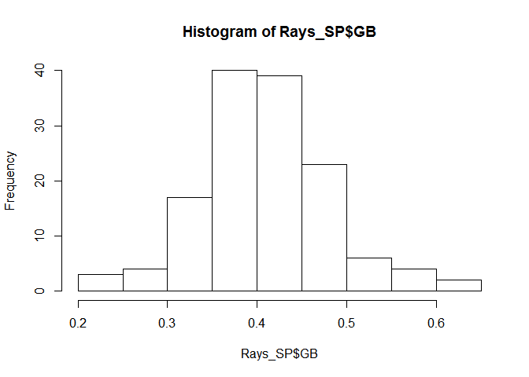
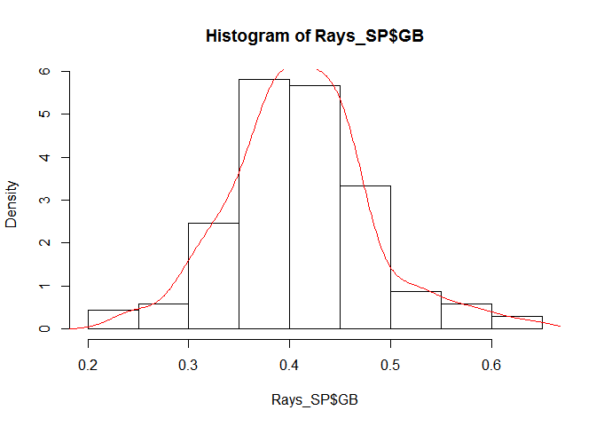
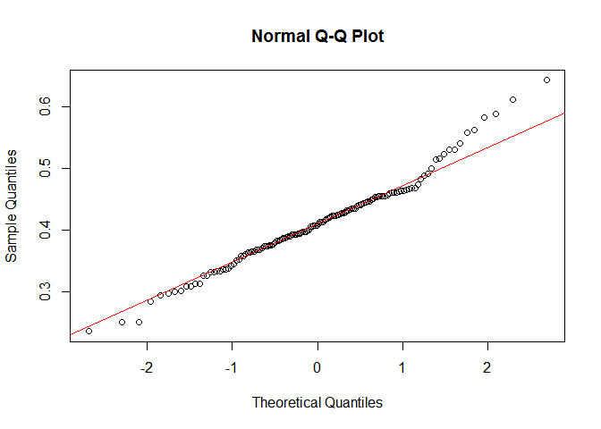
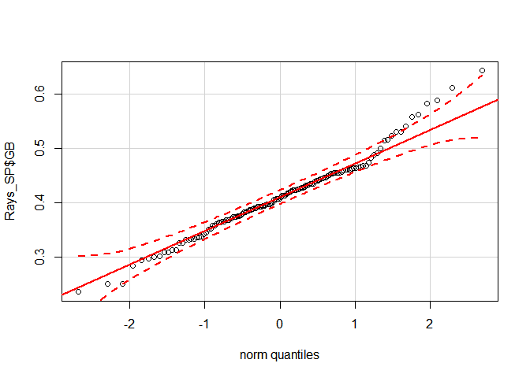
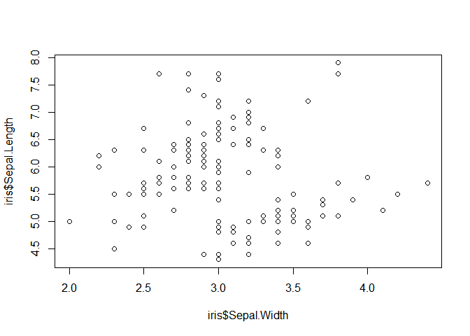

# NRE538_Basic R commands and data visualization
Oscar Feng-Hsun Chang  
Week2  

# Set working directory

First things first, always set the working directory before you start a new project, so that your projects are not inferring each other. Let's set the working directory for this lab by using `setwd("desired directory")`.  
For example, When I was writing this document, my working directory was "D:/Courses/UM/2016_WN/NRE538_stats/NRE538_GSRA/Labs/NRE538_Lab1". Make sure you use forward slash "/". 

Be sure to set the directory where you save the file. 


```r
setwd("D:/Courses/UM/2016_WN/NRE538_GSRA/Labs/NRE538_Lab1")
```

# Read in data

Once you set the working directory, you can start to read in the data you want to work on. Let's try to read in the data with `read.table("file name")` and name it as "Rays_SP".  
This data is the baseball statistics of all the starting pitchers in MLB team Tampa Bay Rays from 1998 to 2015. We can take a glimpse of what "Rays_SP" is by using `head()`. 


```r
setwd("D:/Courses/UM/2016_WN/NRE538_GSRA/Labs/NRE538_Lab1")
Rays_SP = read.table("Rays_starter_1998_2015.csv",header=T,fill=T,sep=",")
head(Rays_SP)
```

```
##   Season          Name  W  L SV  G GS    IP    K9  BB9  HR9 BABIP   LOB
## 1   2015  Chris Archer 12 13  0 34 34 212.0 10.70 2.80 0.81 0.295 0.731
## 2   2012   David Price 20  5  0 31 31 211.0  8.74 2.52 0.68 0.285 0.811
## 3   2007  Scott Kazmir 13  9  0 34 34 206.2 10.41 3.88 0.78 0.333 0.753
## 4   2011 James Shields 16 12  0 33 33 249.1  8.12 2.35 0.94 0.258 0.796
## 5   2013   David Price 10  8  0 27 27 186.2  7.28 1.30 0.77 0.298 0.700
## 6   2011   David Price 12 13  0 34 34 224.1  8.75 2.53 0.88 0.281 0.733
##      GB  HRFB  ERA  FIP xFIP WAR playerid
## 1 0.461 0.104 3.23 2.90 3.01 5.2     6345
## 2 0.531 0.105 2.56 3.05 3.12 5.0     3184
## 3 0.431 0.081 3.48 3.45 3.67 4.8     4897
## 4 0.462 0.111 2.82 3.42 3.25 4.5     7059
## 5 0.449 0.086 3.33 3.03 3.27 4.4     3184
## 6 0.443 0.097 3.49 3.32 3.32 4.4     3184
```

# Data type / Varaible type

Let's take a look what type of data we just read in.  
1.Now use `class()` to see what is the data type of "Rays_SP".  


```r
class(Rays_SP)
```

```
## [1] "data.frame"
```
* What does "data.frame" mean?  

2.Now use `str()` to see what are the data type of variables in "Rays_SP".  


```r
str(Rays_SP)
```

```
## 'data.frame':	188 obs. of  20 variables:
##  $ Season  : int  2015 2012 2007 2011 2013 2011 2012 2010 2007 2014 ...
##  $ Name    : Factor w/ 82 levels "Albie Lopez",..: 13 18 69 35 18 18 35 18 35 18 ...
##  $ W       : int  12 20 13 16 10 12 15 19 12 11 ...
##  $ L       : int  13 5 9 12 8 13 10 6 8 8 ...
##  $ SV      : int  0 0 0 0 0 0 0 0 0 0 ...
##  $ G       : int  34 31 34 33 27 34 33 31 31 23 ...
##  $ GS      : int  34 31 34 33 27 34 33 31 31 23 ...
##  $ IP      : num  212 211 206 249 186 ...
##  $ K9      : num  10.7 8.74 10.41 8.12 7.28 ...
##  $ BB9     : num  2.8 2.52 3.88 2.35 1.3 2.53 2.29 3.42 1.51 1.21 ...
##  $ HR9     : num  0.81 0.68 0.78 0.94 0.77 0.88 0.99 0.65 1.17 1.05 ...
##  $ BABIP   : num  0.295 0.285 0.333 0.258 0.298 0.281 0.292 0.271 0.282 0.301 ...
##  $ LOB     : num  0.731 0.811 0.753 0.796 0.7 0.733 0.719 0.785 0.718 0.744 ...
##  $ GB      : num  0.461 0.531 0.431 0.462 0.449 0.443 0.523 0.439 0.434 0.405 ...
##  $ HRFB    : num  0.104 0.105 0.081 0.111 0.086 0.097 0.134 0.066 0.111 0.112 ...
##  $ ERA     : num  3.23 2.56 3.48 2.82 3.33 3.49 3.52 2.73 3.85 3.11 ...
##  $ FIP     : num  2.9 3.05 3.45 3.42 3.03 3.32 3.47 3.43 3.86 2.93 ...
##  $ xFIP    : num  3.01 3.12 3.67 3.25 3.27 3.32 3.24 3.84 3.65 2.7 ...
##  $ WAR     : num  5.2 5 4.8 4.5 4.4 4.4 4.2 4.1 4 3.8 ...
##  $ playerid: int  6345 3184 4897 7059 3184 3184 7059 3184 7059 3184 ...
```
* Now we have "factor", "integer", "numeric"...etc. What does the output of each variable mean?  

The basic data types in __R__ are _integer_, _numeric_ (real numbers), _logical_ (TRUE or FALSE), _character_ (alphanumeric strings). __R__ organizes these data into _vectors_ of one of these types. Take the ERA variable in the "Rays_SP" data for example, it is a _vector_ of _numeric_ variables.  

In addition, there is a _factor_ data type. _Factors_ are __R__'s way to deal with categorical variables. It is structured as a set of levels (integers) along with a set of labels associated with each level. For example, Name variable in the "Rays_SP" data is a _vector_ of _factor_ variable with 82 levels and each level is associated with a pitcher's name.  

So, a _data frama_ in __R__ is a structure of data that combines _vectors_ (columns) of different types of data (e.g. _integer_, _factor_, _numeric_...etc.). _Data frame_ is therefore a hybrid of _list_ and _matrix_. A _list_ is structure of data that stores more than one type of data in a single dimension, and a _matrix_ is a two dimensional data structure with single data type. When dealing with _data frame_, we can pick an arbitrary column by using `$`. You will see lots of `$` in the following scripts. 

--------------------------------------------------------------------------------------------------------------------------

__Exercise 1__

1. Pick any variable you like in the "Rays_SP" data by using `$`. 

2. Create a list containing multiple types of data with `list()` and create a matrix with `matrix()`.  
When you don't know how to use `c()` or `matrix()`, try `?c` and `?matrix`.

--------------------------------------------------------------------------------------------------------------------------

> Check this [R Tutorial book](http://www.r-tutor.com/r-introduction/basic-data-types) to familiar yourself with basic data types in R.  

# Basic data cleaning/reorganizing

## `Order()`

Order the data with `order()`


```r
SP.ord = Rays_SP[order(Rays_SP$Season),]
SP.ord.rev = Rays_SP[order(Rays_SP$Season, decreasing=TRUE),]
head(SP.ord)
```

```
##     Season           Name  W  L SV  G GS    IP   K9  BB9  HR9 BABIP   LOB
## 16    1998 Rolando Arrojo 14 12  0 32 32 202.0 6.77 2.90 0.94 0.292 0.781
## 18    1998  Tony Saunders  6 15  0 31 31 192.1 8.05 5.19 0.70 0.320 0.743
## 55    1998 Wilson Alvarez  6 14  0 25 25 142.2 6.75 4.29 1.14 0.265 0.710
## 86    1998    Bryan Rekar  2  8  0 15 15  85.2 5.78 2.21 1.68 0.290 0.649
## 88    1998  Julio Santana  4  6  0 19 19 116.2 3.39 3.78 1.08 0.276 0.716
## 114   1998  Jason Johnson  2  5  0 13 13  60.0 5.40 4.05 1.35 0.327 0.722
##     GB HRFB  ERA  FIP xFIP WAR playerid
## 16  NA   NA 3.56 4.23   NA 3.3      174
## 18  NA   NA 4.12 4.21   NA 3.2  1011463
## 55  NA   NA 4.73 4.90   NA 1.3     1193
## 86  NA   NA 5.04 5.09   NA 0.6      625
## 88  NA   NA 4.47 5.31   NA 0.6      496
## 114 NA   NA 5.70 5.39   NA 0.2      147
```

```r
head(SP.ord.rev)
```

```
##     Season           Name  W  L SV  G GS    IP    K9  BB9  HR9 BABIP   LOB
## 1     2015   Chris Archer 12 13  0 34 34 212.0 10.70 2.80 0.81 0.295 0.731
## 22    2015  Jake Odorizzi  9  9  0 28 28 169.1  7.97 2.44 0.96 0.271 0.770
## 28    2015 Erasmo Ramirez 11  6  0 27 27 151.1  6.90 2.20 0.89 0.272 0.728
## 47    2015     Nate Karns  7  5  0 26 26 144.0  8.81 3.44 1.12 0.283 0.780
## 76    2015     Drew Smyly  5  2  0 12 12  66.2 10.39 2.70 1.48 0.283 0.865
## 105   2015  Matt Andriese  2  2  0  8  8  35.1  5.86 2.29 1.02 0.286 0.743
##        GB  HRFB  ERA  FIP xFIP WAR playerid
## 1   0.461 0.104 3.23 2.90 3.01 5.2     6345
## 22  0.373 0.090 3.35 3.61 3.96 2.9     6397
## 28  0.464 0.102 3.51 3.76 3.91 2.3    10314
## 47  0.423 0.124 3.69 4.05 3.91 1.5    12638
## 76  0.368 0.143 3.10 3.91 3.47 0.9    11760
## 105 0.474 0.098 3.57 4.15 4.39 0.4    12022
```

##`subset()`

Subset (rows)/select(columns) with `subset()`

```r
SP.sub = subset(Rays_SP, ERA<2.5)
print(SP.sub)
```

```
##     Season              Name W L SV G GS   IP    K9   BB9  HR9 BABIP   LOB
## 63    2014        Drew Smyly 3 1  0 7  7 47.2  8.31  2.08 0.76 0.184 0.888
## 77    2000    Tanyon Sturtze 3 0  0 5  5 27.2  7.48  1.95 0.65 0.301 0.828
## 81    2010 Jeremy Hellickson 3 0  0 4  4 26.1  8.54  1.37 0.68 0.209 0.824
## 95    2014       Alex Colome 2 0  0 3  3 18.2  6.27  2.89 0.00 0.231 0.944
## 102   2011        Matt Moore 1 0  0 1  1  5.0 19.80  1.80 0.00 0.500 1.000
## 112   2001  Jason Standridge 0 0  0 1  1  6.1  7.11  1.42 0.00 0.235 1.000
## 129   2015       Steve Geltz 0 0  0 2  2  4.0  4.50  2.25 0.00 0.167 0.667
## 130   2008       David Price 0 0  0 1  1  5.1  5.06  5.06 0.00 0.222 0.714
## 142   2012       Cesar Ramos 0 0  0 1  1  2.2  6.75 10.12 0.00 0.000 1.000
## 145   2013       Alex Colome 1 1  0 3  3 16.0  6.75  5.06 1.13 0.255 0.755
## 148   2013       Enny Romero 0 0  0 1  1  4.2  0.00  7.71 0.00 0.071 1.000
##        GB  HRFB  ERA   FIP  xFIP WAR playerid
## 63  0.333 0.073 1.70  3.07  3.40 1.2    11760
## 77     NA    NA 2.28  3.06    NA 0.9     1230
## 81  0.412 0.063 2.05  2.74  3.23 0.8     4371
## 95  0.385 0.000 0.48  2.70  4.03 0.5     6661
## 102 0.250 0.000 0.00 -0.77 -0.27 0.4     1890
## 112    NA    NA 0.00  1.94    NA 0.3     1229
## 129 0.583 0.000 2.25  2.88  4.36 0.1     8402
## 130 0.611 0.000 1.69  3.69  5.18 0.1     3184
## 142 0.500 0.000 0.00  4.97  6.07 0.0     3357
## 145 0.429 0.118 2.25  5.05  4.87 0.0     6661
## 148 0.643 0.000 0.00  5.62  6.79 0.0     4001
```

```r
SP.sub.1 = subset(Rays_SP, ERA<2.5, select=c(Season, Name, W, L))
print(SP.sub.1)
```

```
##     Season              Name W L
## 63    2014        Drew Smyly 3 1
## 77    2000    Tanyon Sturtze 3 0
## 81    2010 Jeremy Hellickson 3 0
## 95    2014       Alex Colome 2 0
## 102   2011        Matt Moore 1 0
## 112   2001  Jason Standridge 0 0
## 129   2015       Steve Geltz 0 0
## 130   2008       David Price 0 0
## 142   2012       Cesar Ramos 0 0
## 145   2013       Alex Colome 1 1
## 148   2013       Enny Romero 0 0
```

##`r/cbind()`

Join data (rbind, cbind) with `rbind` or `cbind`

```r
SP.sub.2 = subset(Rays_SP, ERA<3)
SP.sub.3 = subset(Rays_SP, ERA>=3 & ERA<4)
rbind(SP.sub.2, SP.sub.3)
```

```
##     Season              Name  W  L SV  G GS    IP    K9   BB9  HR9 BABIP
## 2     2012       David Price 20  5  0 31 31 211.0  8.74  2.52 0.68 0.285
## 4     2011     James Shields 16 12  0 33 33 249.1  8.12  2.35 0.94 0.258
## 8     2010       David Price 19  6  0 31 31 207.2  8.10  3.42 0.65 0.271
## 24    2014         Alex Cobb 10  9  0 27 27 166.1  8.06  2.54 0.60 0.282
## 27    2013         Alex Cobb 11  3  0 22 22 143.1  8.41  2.83 0.82 0.279
## 42    2011 Jeremy Hellickson 13 10  0 29 29 189.0  5.57  3.43 1.00 0.223
## 63    2014        Drew Smyly  3  1  0  7  7  47.2  8.31  2.08 0.76 0.184
## 77    2000    Tanyon Sturtze  3  0  0  5  5  27.2  7.48  1.95 0.65 0.301
## 81    2010 Jeremy Hellickson  3  0  0  4  4  26.1  8.54  1.37 0.68 0.209
## 95    2014       Alex Colome  2  0  0  3  3  18.2  6.27  2.89 0.00 0.231
## 102   2011        Matt Moore  1  0  0  1  1   5.0 19.80  1.80 0.00 0.500
## 112   2001  Jason Standridge  0  0  0  1  1   6.1  7.11  1.42 0.00 0.235
## 129   2015       Steve Geltz  0  0  0  2  2   4.0  4.50  2.25 0.00 0.167
## 130   2008       David Price  0  0  0  1  1   5.1  5.06  5.06 0.00 0.222
## 142   2012       Cesar Ramos  0  0  0  1  1   2.2  6.75 10.12 0.00 0.000
## 143   2014        Matt Moore  0  2  0  2  2  10.0  5.40  4.50 0.90 0.281
## 145   2013       Alex Colome  1  1  0  3  3  16.0  6.75  5.06 1.13 0.255
## 148   2013       Enny Romero  0  0  0  1  1   4.2  0.00  7.71 0.00 0.071
## 1     2015      Chris Archer 12 13  0 34 34 212.0 10.70  2.80 0.81 0.295
## 3     2007      Scott Kazmir 13  9  0 34 34 206.2 10.41  3.88 0.78 0.333
## 5     2013       David Price 10  8  0 27 27 186.2  7.28  1.30 0.77 0.298
## 6     2011       David Price 12 13  0 34 34 224.1  8.75  2.53 0.88 0.281
## 7     2012     James Shields 15 10  0 33 33 227.2  8.82  2.29 0.99 0.292
## 9     2007     James Shields 12  8  0 31 31 215.0  7.70  1.51 1.17 0.282
## 10    2014       David Price 11  8  0 23 23 170.2  9.97  1.21 1.05 0.301
## 11    2008     James Shields 14  8  0 33 33 215.0  6.70  1.67 1.00 0.287
## 12    2006      Scott Kazmir 10  8  0 24 24 144.2 10.14  3.24 0.93 0.310
## 13    2005      Scott Kazmir 10  9  0 32 32 186.0  8.42  4.84 0.58 0.307
## 16    1998    Rolando Arrojo 14 12  0 32 32 202.0  6.77  2.90 0.94 0.292
## 17    2014      Chris Archer 10  9  0 32 32 194.2  8.00  3.33 0.55 0.296
## 19    2008        Matt Garza 11  9  0 30 30 184.2  6.24  2.88 0.93 0.270
## 20    2009        Matt Garza  8 12  0 32 32 203.0  8.38  3.50 1.11 0.273
## 21    2009      Jeff Niemann 13  6  0 30 30 177.2  6.28  2.99 0.86 0.297
## 22    2015     Jake Odorizzi  9  9  0 28 28 169.1  7.97  2.44 0.96 0.271
## 25    2012        Matt Moore 11 11  0 31 31 177.1  8.88  4.11 0.91 0.293
## 28    2015    Erasmo Ramirez 11  6  0 27 27 151.1  6.90  2.20 0.89 0.272
## 33    2008      Scott Kazmir 12  8  0 27 27 152.1  9.81  4.14 1.36 0.265
## 34    2010        Matt Garza 15 10  0 32 32 204.0  6.62  2.74 1.24 0.272
## 37    2013        Matt Moore 17  4  0 27 27 150.1  8.56  4.55 0.84 0.259
## 40    2000       Albie Lopez  9  9  0 24 24 157.2  4.68  3.08 1.26 0.281
## 44    2003   Geremi Gonzalez  6 11  0 25 25 156.1  5.58  3.97 1.04 0.239
## 47    2015        Nate Karns  7  5  0 26 26 144.0  8.81  3.44 1.12 0.283
## 49    2000       Paul Wilson  1  2  0  7  7  41.0  7.24  2.20 0.22 0.259
## 57    2013      Chris Archer  9  7  0 23 23 128.2  7.06  2.66 1.05 0.253
## 64    2012 Jeremy Hellickson 10 11  0 31 31 177.0  6.31  3.00 1.27 0.261
## 68    2009        Wade Davis  2  2  0  6  6  36.1  8.92  3.22 0.50 0.313
## 70    2006  Mark Hendrickson  4  8  0 13 13  89.2  5.12  3.41 1.00 0.254
## 76    2015        Drew Smyly  5  2  0 12 12  66.2 10.39  2.70 1.48 0.283
## 78    2012      Jeff Niemann  2  3  0  8  8  38.0  8.05  2.84 0.47 0.264
## 79    2011         Alex Cobb  3  2  0  9  9  52.2  6.32  3.59 0.51 0.284
## 84    2012      Chris Archer  1  2  0  4  4  23.2 11.79  3.04 0.76 0.294
## 98    2003     Doug Waechter  2  2  0  5  5  33.0  7.09  3.55 1.09 0.253
## 101   2006      Brian Stokes  1  0  0  4  4  21.1  5.06  2.95 0.84 0.329
## 105   2015     Matt Andriese  2  2  0  8  8  35.1  5.86  2.29 1.02 0.286
## 135   2010  Andy Sonnanstine  1  1  0  4  4  18.0  3.50  5.00 0.50 0.242
##       LOB    GB  HRFB  ERA   FIP  xFIP WAR playerid
## 2   0.811 0.531 0.105 2.56  3.05  3.12 5.0     3184
## 4   0.796 0.462 0.111 2.82  3.42  3.25 4.5     7059
## 8   0.785 0.439 0.066 2.73  3.43  3.84 4.1     3184
## 24  0.779 0.562 0.085 2.87  3.23  3.33 2.8     6562
## 27  0.814 0.558 0.148 2.76  3.36  3.02 2.5     6562
## 42  0.820 0.350 0.081 2.95  4.44  4.72 1.7     4371
## 63  0.888 0.333 0.073 1.70  3.07  3.40 1.2    11760
## 77  0.828    NA    NA 2.28  3.06    NA 0.9     1230
## 81  0.824 0.412 0.063 2.05  2.74  3.23 0.8     4371
## 95  0.944 0.385 0.000 0.48  2.70  4.03 0.5     6661
## 102 1.000 0.250 0.000 0.00 -0.77 -0.27 0.4     1890
## 112 1.000    NA    NA 0.00  1.94    NA 0.3     1229
## 129 0.667 0.583 0.000 2.25  2.88  4.36 0.1     8402
## 130 0.714 0.611 0.000 1.69  3.69  5.18 0.1     3184
## 142 1.000 0.500 0.000 0.00  4.97  6.07 0.0     3357
## 143 0.882 0.455 0.111 2.70  4.73  4.54 0.0     1890
## 145 0.755 0.429 0.118 2.25  5.05  4.87 0.0     6661
## 148 1.000 0.643 0.000 0.00  5.62  6.79 0.0     4001
## 1   0.731 0.461 0.104 3.23  2.90  3.01 5.2     6345
## 3   0.753 0.431 0.081 3.48  3.45  3.67 4.8     4897
## 5   0.700 0.449 0.086 3.33  3.03  3.27 4.4     3184
## 6   0.733 0.443 0.097 3.49  3.32  3.32 4.4     3184
## 7   0.719 0.523 0.134 3.52  3.47  3.24 4.2     7059
## 9   0.718 0.434 0.111 3.85  3.86  3.65 4.0     7059
## 10  0.744 0.405 0.112 3.11  2.93  2.70 3.8     3184
## 11  0.733 0.463 0.098 3.56  3.82  3.87 3.8     7059
## 12  0.770 0.420 0.099 3.24  3.36  3.48 3.6     4897
## 13  0.724 0.423 0.060 3.77  3.76  4.41 3.6     4897
## 16  0.781    NA    NA 3.56  4.23    NA 3.3      174
## 17  0.716 0.465 0.069 3.33  3.39  3.70 3.2     6345
## 19  0.729 0.417 0.084 3.70  4.14  4.42 3.1     3340
## 20  0.750 0.397 0.102 3.95  4.17  4.14 3.0     3340
## 21  0.743 0.407 0.078 3.85  4.08  4.44 2.9     8591
## 22  0.770 0.373 0.090 3.35  3.61  3.96 2.9     6397
## 25  0.729 0.374 0.086 3.81  3.93  4.35 2.7     1890
## 28  0.728 0.464 0.102 3.51  3.76  3.91 2.3    10314
## 33  0.825 0.308 0.120 3.49  4.37  4.07 2.0     4897
## 34  0.753 0.358 0.100 3.93  4.41  4.29 1.9     3340
## 37  0.786 0.394 0.080 3.29  3.95  4.32 1.8     1890
## 40  0.757    NA    NA 3.88  4.95    NA 1.8      102
## 44  0.755 0.331 0.081 3.91  4.84  5.41 1.7     1711
## 47  0.780 0.423 0.124 3.69  4.05  3.91 1.5    12638
## 49  0.657    NA    NA 3.29  2.79    NA 1.5     1234
## 57  0.788 0.468 0.117 3.22  4.07  3.91 1.3     6345
## 64  0.827 0.418 0.124 3.10  4.60  4.44 1.2     4371
## 68  0.625 0.390 0.056 3.72  2.90  3.49 1.1     7441
## 70  0.728 0.488 0.086 3.81  4.66  5.03 1.1     1574
## 76  0.865 0.368 0.143 3.10  3.91  3.47 0.9    11760
## 78  0.655 0.514 0.063 3.08  3.09  3.65 0.9     8591
## 79  0.749 0.540 0.070 3.42  3.61  3.90 0.8     6562
## 84  0.603 0.434 0.105 3.80  2.71  2.79 0.7     6345
## 98  0.791 0.284 0.078 3.55  4.30  4.98 0.4     1814
## 101 0.828 0.427 0.061 3.38  4.22  5.18 0.4     8653
## 105 0.743 0.474 0.098 3.57  4.15  4.39 0.4    12022
## 135 0.781 0.468 0.059 3.50  4.86  5.29 0.1     7667
```

```r
SP.sub.4 = subset(Rays_SP, ERA<3, select=c(Season, Name, W, L))
SP.sub.5 = subset(Rays_SP, ERA<3, select=c(G, GS, IP))
cbind(SP.sub.4, SP.sub.5)
```

```
##     Season              Name  W  L  G GS    IP
## 2     2012       David Price 20  5 31 31 211.0
## 4     2011     James Shields 16 12 33 33 249.1
## 8     2010       David Price 19  6 31 31 207.2
## 24    2014         Alex Cobb 10  9 27 27 166.1
## 27    2013         Alex Cobb 11  3 22 22 143.1
## 42    2011 Jeremy Hellickson 13 10 29 29 189.0
## 63    2014        Drew Smyly  3  1  7  7  47.2
## 77    2000    Tanyon Sturtze  3  0  5  5  27.2
## 81    2010 Jeremy Hellickson  3  0  4  4  26.1
## 95    2014       Alex Colome  2  0  3  3  18.2
## 102   2011        Matt Moore  1  0  1  1   5.0
## 112   2001  Jason Standridge  0  0  1  1   6.1
## 129   2015       Steve Geltz  0  0  2  2   4.0
## 130   2008       David Price  0  0  1  1   5.1
## 142   2012       Cesar Ramos  0  0  1  1   2.2
## 143   2014        Matt Moore  0  2  2  2  10.0
## 145   2013       Alex Colome  1  1  3  3  16.0
## 148   2013       Enny Romero  0  0  1  1   4.2
```

##`merge()`

Merge data with `merge`

```r
merge(SP.sub.2, SP.sub.3, by.x="Season", by.y="Season")
```

```
##    Season            Name.x W.x L.x SV.x G.x GS.x  IP.x  K9.x BB9.x HR9.x
## 1    2000    Tanyon Sturtze   3   0    0   5    5  27.2  7.48  1.95  0.65
## 2    2000    Tanyon Sturtze   3   0    0   5    5  27.2  7.48  1.95  0.65
## 3    2008       David Price   0   0    0   1    1   5.1  5.06  5.06  0.00
## 4    2008       David Price   0   0    0   1    1   5.1  5.06  5.06  0.00
## 5    2008       David Price   0   0    0   1    1   5.1  5.06  5.06  0.00
## 6    2010 Jeremy Hellickson   3   0    0   4    4  26.1  8.54  1.37  0.68
## 7    2010 Jeremy Hellickson   3   0    0   4    4  26.1  8.54  1.37  0.68
## 8    2010       David Price  19   6    0  31   31 207.2  8.10  3.42  0.65
## 9    2010       David Price  19   6    0  31   31 207.2  8.10  3.42  0.65
## 10   2011     James Shields  16  12    0  33   33 249.1  8.12  2.35  0.94
## 11   2011     James Shields  16  12    0  33   33 249.1  8.12  2.35  0.94
## 12   2011 Jeremy Hellickson  13  10    0  29   29 189.0  5.57  3.43  1.00
## 13   2011 Jeremy Hellickson  13  10    0  29   29 189.0  5.57  3.43  1.00
## 14   2011        Matt Moore   1   0    0   1    1   5.0 19.80  1.80  0.00
## 15   2011        Matt Moore   1   0    0   1    1   5.0 19.80  1.80  0.00
## 16   2012       David Price  20   5    0  31   31 211.0  8.74  2.52  0.68
## 17   2012       David Price  20   5    0  31   31 211.0  8.74  2.52  0.68
## 18   2012       David Price  20   5    0  31   31 211.0  8.74  2.52  0.68
## 19   2012       David Price  20   5    0  31   31 211.0  8.74  2.52  0.68
## 20   2012       David Price  20   5    0  31   31 211.0  8.74  2.52  0.68
## 21   2012       Cesar Ramos   0   0    0   1    1   2.2  6.75 10.12  0.00
## 22   2012       Cesar Ramos   0   0    0   1    1   2.2  6.75 10.12  0.00
## 23   2012       Cesar Ramos   0   0    0   1    1   2.2  6.75 10.12  0.00
## 24   2012       Cesar Ramos   0   0    0   1    1   2.2  6.75 10.12  0.00
## 25   2012       Cesar Ramos   0   0    0   1    1   2.2  6.75 10.12  0.00
## 26   2013         Alex Cobb  11   3    0  22   22 143.1  8.41  2.83  0.82
## 27   2013         Alex Cobb  11   3    0  22   22 143.1  8.41  2.83  0.82
## 28   2013         Alex Cobb  11   3    0  22   22 143.1  8.41  2.83  0.82
## 29   2013       Alex Colome   1   1    0   3    3  16.0  6.75  5.06  1.13
## 30   2013       Alex Colome   1   1    0   3    3  16.0  6.75  5.06  1.13
## 31   2013       Alex Colome   1   1    0   3    3  16.0  6.75  5.06  1.13
## 32   2013       Enny Romero   0   0    0   1    1   4.2  0.00  7.71  0.00
## 33   2013       Enny Romero   0   0    0   1    1   4.2  0.00  7.71  0.00
## 34   2013       Enny Romero   0   0    0   1    1   4.2  0.00  7.71  0.00
## 35   2014         Alex Cobb  10   9    0  27   27 166.1  8.06  2.54  0.60
## 36   2014         Alex Cobb  10   9    0  27   27 166.1  8.06  2.54  0.60
## 37   2014       Alex Colome   2   0    0   3    3  18.2  6.27  2.89  0.00
## 38   2014       Alex Colome   2   0    0   3    3  18.2  6.27  2.89  0.00
## 39   2014        Matt Moore   0   2    0   2    2  10.0  5.40  4.50  0.90
## 40   2014        Matt Moore   0   2    0   2    2  10.0  5.40  4.50  0.90
## 41   2014        Drew Smyly   3   1    0   7    7  47.2  8.31  2.08  0.76
## 42   2014        Drew Smyly   3   1    0   7    7  47.2  8.31  2.08  0.76
## 43   2015       Steve Geltz   0   0    0   2    2   4.0  4.50  2.25  0.00
## 44   2015       Steve Geltz   0   0    0   2    2   4.0  4.50  2.25  0.00
## 45   2015       Steve Geltz   0   0    0   2    2   4.0  4.50  2.25  0.00
## 46   2015       Steve Geltz   0   0    0   2    2   4.0  4.50  2.25  0.00
## 47   2015       Steve Geltz   0   0    0   2    2   4.0  4.50  2.25  0.00
## 48   2015       Steve Geltz   0   0    0   2    2   4.0  4.50  2.25  0.00
##    BABIP.x LOB.x  GB.x HRFB.x ERA.x FIP.x xFIP.x WAR.x playerid.x
## 1    0.301 0.828    NA     NA  2.28  3.06     NA   0.9       1230
## 2    0.301 0.828    NA     NA  2.28  3.06     NA   0.9       1230
## 3    0.222 0.714 0.611  0.000  1.69  3.69   5.18   0.1       3184
## 4    0.222 0.714 0.611  0.000  1.69  3.69   5.18   0.1       3184
## 5    0.222 0.714 0.611  0.000  1.69  3.69   5.18   0.1       3184
## 6    0.209 0.824 0.412  0.063  2.05  2.74   3.23   0.8       4371
## 7    0.209 0.824 0.412  0.063  2.05  2.74   3.23   0.8       4371
## 8    0.271 0.785 0.439  0.066  2.73  3.43   3.84   4.1       3184
## 9    0.271 0.785 0.439  0.066  2.73  3.43   3.84   4.1       3184
## 10   0.258 0.796 0.462  0.111  2.82  3.42   3.25   4.5       7059
## 11   0.258 0.796 0.462  0.111  2.82  3.42   3.25   4.5       7059
## 12   0.223 0.820 0.350  0.081  2.95  4.44   4.72   1.7       4371
## 13   0.223 0.820 0.350  0.081  2.95  4.44   4.72   1.7       4371
## 14   0.500 1.000 0.250  0.000  0.00 -0.77  -0.27   0.4       1890
## 15   0.500 1.000 0.250  0.000  0.00 -0.77  -0.27   0.4       1890
## 16   0.285 0.811 0.531  0.105  2.56  3.05   3.12   5.0       3184
## 17   0.285 0.811 0.531  0.105  2.56  3.05   3.12   5.0       3184
## 18   0.285 0.811 0.531  0.105  2.56  3.05   3.12   5.0       3184
## 19   0.285 0.811 0.531  0.105  2.56  3.05   3.12   5.0       3184
## 20   0.285 0.811 0.531  0.105  2.56  3.05   3.12   5.0       3184
## 21   0.000 1.000 0.500  0.000  0.00  4.97   6.07   0.0       3357
## 22   0.000 1.000 0.500  0.000  0.00  4.97   6.07   0.0       3357
## 23   0.000 1.000 0.500  0.000  0.00  4.97   6.07   0.0       3357
## 24   0.000 1.000 0.500  0.000  0.00  4.97   6.07   0.0       3357
## 25   0.000 1.000 0.500  0.000  0.00  4.97   6.07   0.0       3357
## 26   0.279 0.814 0.558  0.148  2.76  3.36   3.02   2.5       6562
## 27   0.279 0.814 0.558  0.148  2.76  3.36   3.02   2.5       6562
## 28   0.279 0.814 0.558  0.148  2.76  3.36   3.02   2.5       6562
## 29   0.255 0.755 0.429  0.118  2.25  5.05   4.87   0.0       6661
## 30   0.255 0.755 0.429  0.118  2.25  5.05   4.87   0.0       6661
## 31   0.255 0.755 0.429  0.118  2.25  5.05   4.87   0.0       6661
## 32   0.071 1.000 0.643  0.000  0.00  5.62   6.79   0.0       4001
## 33   0.071 1.000 0.643  0.000  0.00  5.62   6.79   0.0       4001
## 34   0.071 1.000 0.643  0.000  0.00  5.62   6.79   0.0       4001
## 35   0.282 0.779 0.562  0.085  2.87  3.23   3.33   2.8       6562
## 36   0.282 0.779 0.562  0.085  2.87  3.23   3.33   2.8       6562
## 37   0.231 0.944 0.385  0.000  0.48  2.70   4.03   0.5       6661
## 38   0.231 0.944 0.385  0.000  0.48  2.70   4.03   0.5       6661
## 39   0.281 0.882 0.455  0.111  2.70  4.73   4.54   0.0       1890
## 40   0.281 0.882 0.455  0.111  2.70  4.73   4.54   0.0       1890
## 41   0.184 0.888 0.333  0.073  1.70  3.07   3.40   1.2      11760
## 42   0.184 0.888 0.333  0.073  1.70  3.07   3.40   1.2      11760
## 43   0.167 0.667 0.583  0.000  2.25  2.88   4.36   0.1       8402
## 44   0.167 0.667 0.583  0.000  2.25  2.88   4.36   0.1       8402
## 45   0.167 0.667 0.583  0.000  2.25  2.88   4.36   0.1       8402
## 46   0.167 0.667 0.583  0.000  2.25  2.88   4.36   0.1       8402
## 47   0.167 0.667 0.583  0.000  2.25  2.88   4.36   0.1       8402
## 48   0.167 0.667 0.583  0.000  2.25  2.88   4.36   0.1       8402
##               Name.y W.y L.y SV.y G.y GS.y  IP.y  K9.y BB9.y HR9.y BABIP.y
## 1        Albie Lopez   9   9    0  24   24 157.2  4.68  3.08  1.26   0.281
## 2        Paul Wilson   1   2    0   7    7  41.0  7.24  2.20  0.22   0.259
## 3         Matt Garza  11   9    0  30   30 184.2  6.24  2.88  0.93   0.270
## 4      James Shields  14   8    0  33   33 215.0  6.70  1.67  1.00   0.287
## 5       Scott Kazmir  12   8    0  27   27 152.1  9.81  4.14  1.36   0.265
## 6         Matt Garza  15  10    0  32   32 204.0  6.62  2.74  1.24   0.272
## 7   Andy Sonnanstine   1   1    0   4    4  18.0  3.50  5.00  0.50   0.242
## 8         Matt Garza  15  10    0  32   32 204.0  6.62  2.74  1.24   0.272
## 9   Andy Sonnanstine   1   1    0   4    4  18.0  3.50  5.00  0.50   0.242
## 10       David Price  12  13    0  34   34 224.1  8.75  2.53  0.88   0.281
## 11         Alex Cobb   3   2    0   9    9  52.2  6.32  3.59  0.51   0.284
## 12       David Price  12  13    0  34   34 224.1  8.75  2.53  0.88   0.281
## 13         Alex Cobb   3   2    0   9    9  52.2  6.32  3.59  0.51   0.284
## 14       David Price  12  13    0  34   34 224.1  8.75  2.53  0.88   0.281
## 15         Alex Cobb   3   2    0   9    9  52.2  6.32  3.59  0.51   0.284
## 16     James Shields  15  10    0  33   33 227.2  8.82  2.29  0.99   0.292
## 17        Matt Moore  11  11    0  31   31 177.1  8.88  4.11  0.91   0.293
## 18 Jeremy Hellickson  10  11    0  31   31 177.0  6.31  3.00  1.27   0.261
## 19      Chris Archer   1   2    0   4    4  23.2 11.79  3.04  0.76   0.294
## 20      Jeff Niemann   2   3    0   8    8  38.0  8.05  2.84  0.47   0.264
## 21     James Shields  15  10    0  33   33 227.2  8.82  2.29  0.99   0.292
## 22        Matt Moore  11  11    0  31   31 177.1  8.88  4.11  0.91   0.293
## 23 Jeremy Hellickson  10  11    0  31   31 177.0  6.31  3.00  1.27   0.261
## 24      Chris Archer   1   2    0   4    4  23.2 11.79  3.04  0.76   0.294
## 25      Jeff Niemann   2   3    0   8    8  38.0  8.05  2.84  0.47   0.264
## 26      Chris Archer   9   7    0  23   23 128.2  7.06  2.66  1.05   0.253
## 27        Matt Moore  17   4    0  27   27 150.1  8.56  4.55  0.84   0.259
## 28       David Price  10   8    0  27   27 186.2  7.28  1.30  0.77   0.298
## 29      Chris Archer   9   7    0  23   23 128.2  7.06  2.66  1.05   0.253
## 30        Matt Moore  17   4    0  27   27 150.1  8.56  4.55  0.84   0.259
## 31       David Price  10   8    0  27   27 186.2  7.28  1.30  0.77   0.298
## 32      Chris Archer   9   7    0  23   23 128.2  7.06  2.66  1.05   0.253
## 33        Matt Moore  17   4    0  27   27 150.1  8.56  4.55  0.84   0.259
## 34       David Price  10   8    0  27   27 186.2  7.28  1.30  0.77   0.298
## 35       David Price  11   8    0  23   23 170.2  9.97  1.21  1.05   0.301
## 36      Chris Archer  10   9    0  32   32 194.2  8.00  3.33  0.55   0.296
## 37       David Price  11   8    0  23   23 170.2  9.97  1.21  1.05   0.301
## 38      Chris Archer  10   9    0  32   32 194.2  8.00  3.33  0.55   0.296
## 39       David Price  11   8    0  23   23 170.2  9.97  1.21  1.05   0.301
## 40      Chris Archer  10   9    0  32   32 194.2  8.00  3.33  0.55   0.296
## 41       David Price  11   8    0  23   23 170.2  9.97  1.21  1.05   0.301
## 42      Chris Archer  10   9    0  32   32 194.2  8.00  3.33  0.55   0.296
## 43        Drew Smyly   5   2    0  12   12  66.2 10.39  2.70  1.48   0.283
## 44      Chris Archer  12  13    0  34   34 212.0 10.70  2.80  0.81   0.295
## 45     Matt Andriese   2   2    0   8    8  35.1  5.86  2.29  1.02   0.286
## 46     Jake Odorizzi   9   9    0  28   28 169.1  7.97  2.44  0.96   0.271
## 47    Erasmo Ramirez  11   6    0  27   27 151.1  6.90  2.20  0.89   0.272
## 48        Nate Karns   7   5    0  26   26 144.0  8.81  3.44  1.12   0.283
##    LOB.y  GB.y HRFB.y ERA.y FIP.y xFIP.y WAR.y playerid.y
## 1  0.757    NA     NA  3.88  4.95     NA   1.8        102
## 2  0.657    NA     NA  3.29  2.79     NA   1.5       1234
## 3  0.729 0.417  0.084  3.70  4.14   4.42   3.1       3340
## 4  0.733 0.463  0.098  3.56  3.82   3.87   3.8       7059
## 5  0.825 0.308  0.120  3.49  4.37   4.07   2.0       4897
## 6  0.753 0.358  0.100  3.93  4.41   4.29   1.9       3340
## 7  0.781 0.468  0.059  3.50  4.86   5.29   0.1       7667
## 8  0.753 0.358  0.100  3.93  4.41   4.29   1.9       3340
## 9  0.781 0.468  0.059  3.50  4.86   5.29   0.1       7667
## 10 0.733 0.443  0.097  3.49  3.32   3.32   4.4       3184
## 11 0.749 0.540  0.070  3.42  3.61   3.90   0.8       6562
## 12 0.733 0.443  0.097  3.49  3.32   3.32   4.4       3184
## 13 0.749 0.540  0.070  3.42  3.61   3.90   0.8       6562
## 14 0.733 0.443  0.097  3.49  3.32   3.32   4.4       3184
## 15 0.749 0.540  0.070  3.42  3.61   3.90   0.8       6562
## 16 0.719 0.523  0.134  3.52  3.47   3.24   4.2       7059
## 17 0.729 0.374  0.086  3.81  3.93   4.35   2.7       1890
## 18 0.827 0.418  0.124  3.10  4.60   4.44   1.2       4371
## 19 0.603 0.434  0.105  3.80  2.71   2.79   0.7       6345
## 20 0.655 0.514  0.063  3.08  3.09   3.65   0.9       8591
## 21 0.719 0.523  0.134  3.52  3.47   3.24   4.2       7059
## 22 0.729 0.374  0.086  3.81  3.93   4.35   2.7       1890
## 23 0.827 0.418  0.124  3.10  4.60   4.44   1.2       4371
## 24 0.603 0.434  0.105  3.80  2.71   2.79   0.7       6345
## 25 0.655 0.514  0.063  3.08  3.09   3.65   0.9       8591
## 26 0.788 0.468  0.117  3.22  4.07   3.91   1.3       6345
## 27 0.786 0.394  0.080  3.29  3.95   4.32   1.8       1890
## 28 0.700 0.449  0.086  3.33  3.03   3.27   4.4       3184
## 29 0.788 0.468  0.117  3.22  4.07   3.91   1.3       6345
## 30 0.786 0.394  0.080  3.29  3.95   4.32   1.8       1890
## 31 0.700 0.449  0.086  3.33  3.03   3.27   4.4       3184
## 32 0.788 0.468  0.117  3.22  4.07   3.91   1.3       6345
## 33 0.786 0.394  0.080  3.29  3.95   4.32   1.8       1890
## 34 0.700 0.449  0.086  3.33  3.03   3.27   4.4       3184
## 35 0.744 0.405  0.112  3.11  2.93   2.70   3.8       3184
## 36 0.716 0.465  0.069  3.33  3.39   3.70   3.2       6345
## 37 0.744 0.405  0.112  3.11  2.93   2.70   3.8       3184
## 38 0.716 0.465  0.069  3.33  3.39   3.70   3.2       6345
## 39 0.744 0.405  0.112  3.11  2.93   2.70   3.8       3184
## 40 0.716 0.465  0.069  3.33  3.39   3.70   3.2       6345
## 41 0.744 0.405  0.112  3.11  2.93   2.70   3.8       3184
## 42 0.716 0.465  0.069  3.33  3.39   3.70   3.2       6345
## 43 0.865 0.368  0.143  3.10  3.91   3.47   0.9      11760
## 44 0.731 0.461  0.104  3.23  2.90   3.01   5.2       6345
## 45 0.743 0.474  0.098  3.57  4.15   4.39   0.4      12022
## 46 0.770 0.373  0.090  3.35  3.61   3.96   2.9       6397
## 47 0.728 0.464  0.102  3.51  3.76   3.91   2.3      10314
## 48 0.780 0.423  0.124  3.69  4.05   3.91   1.5      12638
```
* It's pretty busy...Can you understand what does merge do to the data?  

All I introduced you here are basic functions built in the _base_ package of __R__ (which means you don't have to install anything). However, there are several packages that allows you to clean/reorganize/munge the data in a more elegant and efficient fashion. They are __reshape2__, __plyr__, __dplyr__, or __tidyr__ packages. There even exist chest sheet for [__dplyr__ and __tidyr__](https://www.rstudio.com/wp-content/uploads/2015/02/data-wrangling-cheatsheet.pdf) packages

# Exploratory Data Analysis

Now, say you have cleaned the data and ready to proceed. The next step is always to check what the data looks like and what are the relationships among variables (a.k.a. exploratory data analysis).  

## Very basic statistics

Remember what mean and variation (standard deviation) are?  
It's very easy to calculate the mean and variance (standard deviation) in __R__ by using `mean()` and `var()`(`sd()`). Let's calculate the mean and variance of the G (Game started) variable. 


```r
mean(Rays_SP$G)
```

```
## [1] 15.5
```

```r
var(Rays_SP$G)
```

```
## [1] 124.7219
```

## Distribution of one variable

Let's plot the histogram of GB (Ground Ball percentage) variable to see what the distribution looks like by `hist()`. 


```r
hist(Rays_SP$GB)
```

<!-- -->

```r
hist(Rays_SP$GB, probability=TRUE)
lines(density(Rays_SP$GB, na.rm=TRUE), col="red")
```

<!-- -->

* What is the differences between the two histogram?
* What does `na.rm=` do?

Let's now see if GB is a normal distribution by using `shapiro.test()`


```r
shapiro.test(Rays_SP$GB)
```

```
## 
## 	Shapiro-Wilk normality test
## 
## data:  Rays_SP$GB
## W = 0.97939, p-value = 0.03491
```

* What does this results tell you. Maybe you want to read the [help page](https://stat.ethz.ch/R-manual/R-devel/library/stats/html/shapiro.test.html) (remember how to do it in __R__?) or [wiki page](https://en.wikipedia.org/wiki/Shapiro%E2%80%93Wilk_test) of Shapiro–Wilk test. 

Alternatively, you can try [Kolmogorov–Smirnov test](https://en.wikipedia.org/wiki/Kolmogorov%E2%80%93Smirnov_test) by using `ks.test()`. Kolmogorov–Smirnov test is basically examining if two probability distributions are the same. 


```r
GB.mean=mean(Rays_SP$GB, na.rm=TRUE)
GB.sd=sd(Rays_SP$GB, na.rm=TRUE)
ks.test(Rays_SP$GB, "qnorm", GB.mean, GB.sd)
```

```
## 
## 	One-sample Kolmogorov-Smirnov test
## 
## data:  Rays_SP$GB
## D = 0.56323, p-value < 2.2e-16
## alternative hypothesis: two-sided
```


Or, you can do [QQ plot](https://en.wikipedia.org/wiki/Q%E2%80%93Q_plot) by using `qqnorm()` plus `qqline()` to see if the sample distribution deviate too much from the theoretical normal distribution. 


```r
qqnorm(Rays_SP$GB); qqline(Rays_SP$GB, col="Red")
```

<!-- -->


Another way to do QQ plot is to use `qqPlot()` in the __car__ package. The benefit of using `qqPlot()` is that it overlay the confidence interval onto the original QQ plot. It is therefore useful to detect outliers from the QQ plot.  
Let's try to install the package by using `install.packages(package name)`. 


```r
install.packages("car")
```

After you successfully installed the __car__ package, make sure you `library()` it, so that __R__ knows where to look for the function you are using. 


```r
library(car)
qqPlot(Rays_SP$GB)
```

<!-- -->


We can see that. if you do not log transform it, there are many points located out side of the 95% confidence interval of the QQ plot. Eyeballing from the QQ plot is the easiest way to detect outliers, although there are several other methods to detect outliers. 

---------------------------------------------------------------------------------------------------------------------------------

__Exercise 2__

Plot the histogram of another variable plus density function and test the normality of it.

---------------------------------------------------------------------------------------------------------------------------------


## Relationship between two variables

In case you are tired of baseball data, we now switch to another data set, [_Iris_ flower data set](https://en.wikipedia.org/wiki/Iris_flower_data_set). This data set is already installed in the _base_ package, so you can just use `data(iris)` to fetch it.  


```r
data(iris)
head(iris)
```

```
##   Sepal.Length Sepal.Width Petal.Length Petal.Width Species
## 1          5.1         3.5          1.4         0.2  setosa
## 2          4.9         3.0          1.4         0.2  setosa
## 3          4.7         3.2          1.3         0.2  setosa
## 4          4.6         3.1          1.5         0.2  setosa
## 5          5.0         3.6          1.4         0.2  setosa
## 6          5.4         3.9          1.7         0.4  setosa
```

Here I want to show you another important part of exploratory data analysis, plotting the relationship between two variables.  
By plotting one variable against another, we can easily investigate the relationship between the two. For example, if we want to see the relationship between sepal length and sepal width, we just plot one against the other.  

```r
plot(iris$Sepal.Length~iris$Sepal.Width)
```

<!-- -->

And if we want to see the correlation coefficient between the two, we can use `cor()`.  

```r
cor(iris$Sepal.Length,iris$Sepal.Width)
```

```
## [1] -0.1175698
```

* Remember what the correlation coefficient is?

What if we want to investigate the correlation among multiple pairs of variables at the same time?  
__R__ has a very handy function called `pairs()`. Try it.


```r
pairs(iris)
```

-1.png)<!-- -->

* What happen to the "Species" variable? 

Also, we can calculate the correlation coefficients among these variables simultaneously as well. Let's try `cor()` again but with different specification. 


```r
cor(iris[,1:4])
```

```
##              Sepal.Length Sepal.Width Petal.Length Petal.Width
## Sepal.Length    1.0000000  -0.1175698    0.8717538   0.8179411
## Sepal.Width    -0.1175698   1.0000000   -0.4284401  -0.3661259
## Petal.Length    0.8717538  -0.4284401    1.0000000   0.9628654
## Petal.Width     0.8179411  -0.3661259    0.9628654   1.0000000
```

* Look up the help page of `cor()` to familiar yourself with this function. 

---------------------------------------------------------------------------------------------------------------------------------

__Exercise 3__

Plot four histograms for each of the four variables in the _Iris_ flower data set (with density functions) and check the normality of them.

---------------------------------------------------------------------------------------------------------------------------------


